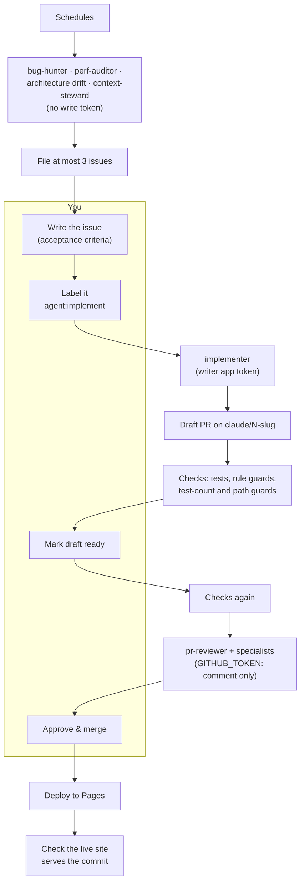

# WORKFLOW.md: AI-assisted development for reddit-post-profiler

This file describes how Claude Code agents and GitHub work together in this repository: who (or what) may change what, when each agent runs, where a human has to look, and why each piece exists. It's written for a solo maintainer on a public repository. Every major decision is traced to a source in [section 9](#9-rationale-appendix).

*Researched and written September 2026, against Claude Code v2.1.28x, `anthropics/claude-code-action` v1.0.234 and GitHub's docs as of 25 Sept 2026. Several pieces it relies on are in preview; they're marked where they're used. Citations like [A3], [G16] and [R5] link to the [sources](#sources) (A = Anthropic, G = GitHub, R = industry reports and research).*

## Contents

1. [Executive summary](#1-executive-summary)
2. [Core principles](#2-core-principles)
3. [Roles and responsibilities](#3-roles-and-responsibilities)
4. [GitHub integration architecture](#4-github-integration-architecture)
5. [Skills, connectors, and plugins](#5-skills-connectors-and-plugins)
6. [Human-in-the-loop checkpoints](#6-human-in-the-loop-checkpoints)
7. [Guardrails and failure modes](#7-guardrails-and-failure-modes)
8. [Suggested file/folder layout](#8-suggested-filefolder-layout)
9. [Rationale appendix](#9-rationale-appendix)
10. [Appendix: starter files](#appendix-starter-files)
11. [Sources](#sources)

---

## 1. Executive summary

The workflow has **eight agent roles and one human**. Each role is a single-purpose Claude Code run with its own tools, token and output contract, defined once in `.claude/agents/<role>.md`. That same file serves an interactive session on your machine (as a subagent) and a GitHub Actions run (via `claude-code-action`).

- **Two roles write code.** The **implementer** (senior developer) and the **refactorer** are started only by you: you label an issue, or comment `@claude` on a PR. They push only `claude/*` branches and open *draft* PRs, and only one writer runs at a time.
- **Four roles review PRs.** The **PR reviewer** always runs. The **architecture**, **security** and **performance** reviewers join when the diff touches their area or you add a label. All four run with a GitHub token that can comment and nothing else.
- **Four roles audit on a schedule** (two of them double as PR specialists). The **bug hunter** runs weekly; the **performance auditor**, **architecture reviewer** (in drift mode) and **context steward** run monthly. In this mode they have no write token at all. They return findings as JSON, and a separate small job files at most three issues. Nothing unattended ever changes code.

Around the agents are three deterministic layers, which do most of the actual protecting:

1. **Checks run before any agent looks at a diff.** Tests, grep-able CLAUDE.md rules, a test-count guard and a workflow linter.
2. **Repository rules make merging something only you can do.** A ruleset requires your code-owner approval; for your own PRs you merge through a logged bypass.
3. **A hook keeps agents out of the files that define their own rules.** These are CLAUDE.md, `.claude/` and `.github/`, plus `hyparquet.js`, `r2-cors.json` and `publish_build.sh` (the vendored library, the bucket's CORS policy, and the script that holds the R2 token in the archive sync).

You touch the loop three times per change: **authorise** it (write the issue, add the label), **vouch** for it (mark the draft ready, which triggers AI review) and **accept** it (approve and merge, which deploys).



**What changes from today.** You already have the two most important pieces: a CLAUDE.md with explicit "Rules for changes", and a PR-only git rule. The biggest changes are these:

- The reviewer moves from the Claude App's read-write token to a comment-only token.
- Every action is pinned to a commit SHA. Today `claude-code-action@v1` is a moving tag. That delivered 2026's two security fixes automatically [R7][R8], but it also means whatever lands on that tag runs with your token, which is how the tj-actions compromise spread [R12]. Pin, and let Dependabot bring the fixes.
- `actions/setup-python@v5` moves to v6. v5 declares Node 20, which is no longer available on Actions runners as of GitHub's 23 Sept 2026 notice [G41].
- `main` gets rulesets that no bot can satisfy.
- The claude.ai Debt Ledger moves to GitHub Issues, because agents running in Actions can't read it.
- CLAUDE.md gets slimmer: module detail moves to path-scoped rules, so each role pays for less context.

The order to do all this in is in [section 4.9](#49-rollout-order).

---

## 2. Core principles

Ten decisions drive everything else. When a later section seems arbitrary, it follows from one of these.

1. **Agents propose; only a human merges, and the repository enforces it.** No agent can approve, merge or deploy. That's enforced by a ruleset requiring code-owner (your) approval. Nothing depends on a prompt asking nicely. GitHub builds its own agent this way: it "cannot approve or merge a pull request", and humans own the merge button [G2][G34].

2. **Permissions come from tokens, rulesets and hooks, never from prompts.** A reviewer runs on a `GITHUB_TOKEN` scoped to `contents: read, pull-requests: write`, so a fully prompt-injected reviewer can still only comment. Anthropic's docs are blunt that instructions are "a request, not a guarantee", and that Bash allow rules are not a security boundary [A6][A4].

3. **Every agent run starts from something you did, or from a schedule that can only file capped issues.**
   - Every agent workflow checks `github.actor == github.repository_owner`.
   - Agents can't start other agents. Events from `GITHUB_TOKEN` don't trigger workflows [G16], and the action refuses bot actors by default [A18].
   - Agents only act on text you wrote (or that an audit filed and you then labelled). This closes the "untrusted issue → privileged agent" path behind PromptPwnd and Clinejection [R1][R5].

4. **Cheap, deterministic checks run before any agent looks at a diff, and any rule a script can decide is a script.** "No `innerHTML`", "requests only in core.js and dumps.js", "imports are `./x.js`" and "no dependencies" are greps, not review comments. The AI reviewer only gets the rules that need judgement. Anthropic's own review plugin excludes "issues that a linter will catch" [A35]. GitHub's guide to reviewing agent PRs starts with CI: "Any change that weakens CI is a blocker" [G33].

5. **One writer at a time, one issue per PR, one branch per issue.**
   - Writers share a repo-wide concurrency group.
   - Each pushes only to the `claude/<issue>-<slug>` branch it created.
   - A refactorer checks for open PRs touching the same files before it starts.
   - Parallelism belongs in your interactive sessions (git worktrees), where you're watching [A1][R25].

6. **Every role reads the same grounding, and only a human changes it.** Every run loads CLAUDE.md. On PRs, the action restores `.claude/` and `CLAUDE.md` from the base branch, so a PR can't rewrite the rules it's reviewed against [A18]. (Copilot code review reads instructions from the head branch [G40].) Agents can't edit grounding files (the hook blocks it), and any PR that does needs your explicit `ack:sensitive`.

7. **Roles are defined by tools, inputs and an output contract, not by personas.** "You are a senior engineer with 20 years' experience" does nothing measurable [R28]. A tool allowlist, a token scope, a JSON schema and a definition of done do.

8. **Signal over coverage.**
   - Each reviewer runs once per PR, posts at most five inline comments, and treats "nothing found" as a normal result.
   - Specialists run only when the diff touches their area.
   - More bot comments correlate with slower merges and less relevant feedback [R20]. And "a reviewer prompted to find gaps will usually report some, even when the work is sound" [A1].

9. **Use the cheapest model and cadence that does the job, and cap everything.**
   - Sonnet for frequent, bounded roles; Opus for rare, judgement-heavy ones.
   - Turn limits, job timeouts and concurrency on every run.
   - One repository variable, `AGENTS_ENABLED`, switches every agent off.
   - All of this runs on your Claude subscription, so it draws on the same usage limits as your interactive sessions [A21].

10. **This repository is public, and so are its Actions logs and artifacts.** No secret other than the Claude token ever reaches an agent's step, and it's scrubbed from subprocess environments. Writer jobs also hold the writer app's key, passed only to the step that mints their token. Findings are written as if published, because they are.

---

## 3. Roles and responsibilities

### 3.1 At a glance

| Role | Where it runs | Started by | Token | Changes | Done means |
|---|---|---|---|---|---|
| **implementer** (senior developer) | CI and interactive | `agent:implement` label on an issue; `@claude` on a PR; you, locally | Your writer app (push `claude/<issue>-*`, open draft PRs) | Code and tests on its own branch | A draft PR with green tests and evidence, or a comment explaining why it stopped |
| **refactorer** | CI and interactive | `agent:refactor` label | Writer app | Code only; existing tests are locked | A draft PR, behaviour unchanged, ≤ ~300 lines |
| **pr-reviewer** | CI | You mark a PR ready (or open it ready); `review:pr-reviewer` | `GITHUB_TOKEN`: comment only | Nothing | ≤ 5 inline comments and one summary |
| **architecture-reviewer** | CI and interactive | PR touches CLAUDE.md, rules, WORKFLOW.md or ADRs, adds a module or changes storage schema; label; monthly | Comment-only on PRs; none in audits | Nothing | A verdict (fits / notes / conflicts) with sources; an ADR draft if needed |
| **security-reviewer** | CI | PR touches `.github/`, `.claude/`, deploy scripts, the archive sync's scripts, config or runbook, CORS or `index.html`; label | Comment only | Nothing | Inline comments and a summary; never quotes a secret |
| **bug-hunter** | CI and interactive | Weekly; manual dispatch | None (findings → JSON) | Nothing (scratch tests on the runner) | ≤ 3 issues, each with a failing reproduction test |
| **perf-auditor** | CI and interactive | Monthly; `review:perf-auditor` on a PR | None, or comment only on a PR | Nothing | Issues or a PR comment with measured before/after numbers |
| **context-steward** | CI | Monthly; dispatch | None | Nothing | Issues listing wrong or dead lines in CLAUDE.md and the agent files, with exact replacement text |

Everything that isn't in this table is either you or a script.

### 3.2 Senior developer (implementer)

- **Trigger.**
  - You add `agent:implement` to an issue you wrote, or to one an audit filed. That label is your authorisation, so read the issue first.
  - Or you run *Agent write* by hand with an issue number.
  - Or you comment `@claude <instruction>` on a PR to have it revise that PR.
  - Locally: `claude --agent implementer`, or "use the implementer subagent on #42".
- **Context.**
  - CLAUDE.md, plus the path-scoped rules for the files it touches.
  - The issue body, fetched with the exact command `gh issue view <N>`. Comments aren't included, so strangers can't inject instructions through them.
  - Node 22 and Python 3.12 with duckdb and pytest.
- **Tools.**
  - Read/Edit/Write.
  - `npm test`, `node --test`, `python -m pytest`.
  - `git switch -c claude/*`, `add`, `commit`, `push -u origin claude/*`.
  - `gh pr create`, `gh pr list`, `gh issue comment <N>`.
  - No web access, no `gh pr merge`, and no edits to CLAUDE.md, `.claude/` or `.github/` (the hook blocks them in CI).
- **May change:** `web/**` (except `hyparquet.js`), `tools/**` (except `r2-cors.json` and `publish_build.sh`), `docs/**`, and new tests. It may add tests but never edit an existing one to make it pass.
- **Done:**
  - A **draft** PR into `main` with green tests. The body has *Summary · Closes #N · How I verified it* (test summary lines pasted) *· Risks and what I didn't do · Grounding* (the exact CLAUDE.md text that should change, if any).
  - Or one comment on the issue saying what's missing, if the acceptance criteria are unclear.
- **Why draft?** Two reasons.
  - A draft is a cheap place for you to glance at the result before you spend review attention and tokens on it.
  - When you mark it ready, *you* are the actor on the `ready_for_review` event. The action only accepts human actors [A18], so this is what starts the reviewers without allowlisting a bot.

### 3.3 Refactor agent (refactorer)

- **Trigger:** the `agent:refactor` label, usually on a debt issue or an architecture-drift finding.
- **Context and tools:** the same as the implementer, plus `AGENT_ROLE=refactorer`. With that set, the hook blocks edits to any *existing* file under `web/tests/` or `tools/tests/`.
- **May change:** code only. Behaviour must stay identical: the same exports, stored keys and value shapes, and the same requests in the same order.
- **Before starting:** it runs `gh pr list --json headRefName,files`. If an open PR touches the same files, it stops and comments on the issue.
- **Done:** a draft PR titled `Refactor: …`, under about 300 changed lines, with the test counts unchanged or higher. CI enforces the counts, and larger PRs need `ack:large`.

### 3.4 PR reviewer (general; you already have this one)

- **Trigger:**
  - A PR is opened ready, reopened, or marked ready for review, by you.
  - Or you add `review:pr-reviewer` to re-run it.
  - It is skipped for drafts, forks, bot actors (so Dependabot's PRs get no review unless you add a `review:` label; see 6.1), and README-only or plan-only (`docs/history/`) PRs.
  - It runs **after** `checks.yml` passes in the same workflow.
- **Context:** CLAUDE.md (from the base branch), the diff, and the changed files in full. Reading them with the Read tool is what loads the path-scoped rules.
- **Tools:** Read/Grep/Glob, `gh pr diff/view/comment`, read-only `git diff/log/show`, and the inline-comment MCP tool, with 50 turns. The token is `GITHUB_TOKEN` with `contents: read, pull-requests: write`, so it can't push, approve or touch issues.
- **Reports only:**
  - Bugs, and security or data-loss risks.
  - CLAUDE.md rule breaks that need judgement: `runId` checks after `await`, cache-key version bumps, focus handling, request patterns that bypass `_get`, and Arctic Shift endpoints or parameters missing from the verified API facts.
- **Done:** at most five inline comments, then one summary ("No blocking issues" or "N issues", plus what a human should check by hand).
- **Change from today:** today it only reviews PRs that touch `web/**` or workflows. Now every PR except README-only or plan-only ones gets it, including `tools/**` changes, and PRs touching `.claude/**` also get the security reviewer.

### 3.5 Architecture reviewer

- **Trigger on PRs:**
  - The diff touches `CLAUDE.md`, `.claude/rules/`, `WORKFLOW.md` or `docs/adr/`, adds a top-level file in `web/`, or changes `DB_VERSION` or `STORES`.
  - Or you add `review:architecture-reviewer`.
- **Trigger in audits:** monthly drift audit.
- **Context:** CLAUDE.md, `docs/adr/*`, and the `adr` skill.
- **What it guards:**
  - No build step and no dependencies.
  - core.js has no DOM, and app.js has no API logic.
  - All requests go through `ArcticShiftClient` or `DumpSource`.
  - Stored names are frozen and keys are versioned.
  - The deploy copy and import rewrite contract.
- **Done on a PR:** one verdict (fits / fits with notes / conflicts), each point citing the CLAUDE.md section or ADR it rests on. If the PR makes a lasting decision, it includes a drafted ADR.
- **Done in audit mode:** up to three findings where code and documented architecture have drifted apart.

### 3.6 Security reviewer (added)

This role isn't on your list. It covers the one area where a mistake is both likely with agents and expensive: the workflows and config that give agents their power.

- **Trigger:** the diff touches `.github/`, `.claude/`, `tools/*.sh`, the archive sync's scripts, config or runbook, `tools/r2-cors.json` or `web/index.html`; or the `review:security-reviewer` label.
- **Looks for:**
  - Widened triggers or permissions, `pull_request_target`, secrets in agent jobs, unpinned actions.
  - Event text interpolated into `run:`.
  - Loosened hooks or tool lists.
  - Untrusted Arctic Shift or import data reaching HTML, links or storage keys.
  - CORS widening.
- **Done:** inline comments and a summary, never quoting a secret or a working exploit, since the logs are public. It doesn't replace the `ack:sensitive` guard. It gives you something to read before you add that label.
- **Why not Anthropic's `claude-code-security-review` action?** It says it is "not hardened against prompt injection attacks and should only be used to review trusted PRs" [A37]. A role file under the same guardrails as every other reviewer is simpler.

### 3.7 Bug hunter

- **Trigger:** Mondays 06:47 UTC (after the 06:17 archive check), or dispatch with an optional focus such as `web/queue.js`.
- **Context:** the repo with 200 commits of history, the fixtures, and the `finding-format` skill.
- **Tools:**
  - Read/Grep/Glob.
  - Edit/Write, which are safe here because the runner is discarded and the job has no write token.
  - `node --test`, `git log/show`, `gh issue list`.
- **Hunting ground named in its file:**
  - `runId` races.
  - The single-tab Web Lock.
  - IndexedDB upgrades and hung stores.
  - Parquet range reads.
  - AIMD backoff at its limits.
  - CSV escaping.
  - Saved-scan import validation.
- **The evidence bar:** a finding counts only if the agent wrote a test that fails for the reason it claims. That test travels in the finding, becomes the first test of the fix, and gives you the "write the failing test first, then fix" separation Anthropic recommends [A1].
- **Done:** structured JSON with at most three findings (none is fine). The filing job turns high and medium findings into issues labelled `agent:finding` and `agent:bug-hunter`, de-duplicated by fingerprint against open *and closed* findings.

### 3.8 Performance auditor

- **Trigger:** the 1st of the month, dispatch, or `review:perf-auditor` on a PR.
- **What "performance" means here:** Arctic Shift requests first, because it's a free, shared, rate-limited service (about 0.8 req/s). Then archive bytes read, then main-thread time.
- **How it measures:** with the `perf-audit` skill's script, using fixtures, the fake clock and an injected fetch. It never calls the live API or R2 bucket; its file and prompt forbid it. Only `archive-sync.yml` calls the live API from CI, and it runs no agent.
- **Done:** findings only with numbers (metric, baseline, current value, responsible code). On a PR it posts one comment with a before/after table.
- **Bootstrap:** the bench script is the first `agent:implement` issue to file.

### 3.9 Context steward (added)

Your CLAUDE.md is unusually precise. It names functions, keys, constants, endpoints and measured numbers, so it drifts. Every other role trusts it, so drift here turns into wrong code everywhere.

- **Trigger:** monthly, or dispatch.
- **Work:** checks every factual claim in CLAUDE.md, WORKFLOW.md's corrections, `.claude/rules/`, the agent files and the skills against the code, using `grep` and `git log -S`.
- **Done:** up to three issues, each with the current text, the correct text and the evidence. It also flags lines that no longer earn their place, to hold CLAUDE.md under about 200 lines [A2].
- **It can't edit CLAUDE.md, and neither can the CI writers.** You apply its proposed text yourself; it's usually a one-line edit.

### 3.10 Deliberately not agents

| Job | Why it isn't an agent |
|---|---|
| **Issue triage** of incoming public issues | It's the classic injection path: untrusted text feeding a privileged agent. Researchers trace Cline's February 2026 supply-chain compromise back to exactly this kind of bot [R5][R6]; Cline's own advisory only says an npm token was compromised. Anthropic's own triage workflow shows how tightly it has to be locked down to be safe [A34]. A solo maintainer triages faster by eye. |
| **Merging, approving, auto-merge** | Principle 1. Copilot code review can now approve PRs (preview) [G31]. This repo opts out. |
| **Dependency and action updates** | Dependabot does this deterministically (see [section 8](#8-suggested-filefolder-layout)). The web app has no dependencies by design. |
| **Checking the live site after a deploy** | A `curl` loop in `ci.yml`. It replaces the manual "after a merge, check the live `.js`" step in CLAUDE.md. |
| **A separate test-writer agent** | This separation already happens: the bug hunter's reproduction test becomes the fix's first test, and the refactorer can't touch existing tests. |

---

## 4. GitHub integration architecture

### 4.1 Two planes, one set of role files

| | Interactive plane | CI plane |
|---|---|---|
| Where | Claude Code on your machine, or Claude Code on the web | GitHub Actions, via `anthropics/claude-code-action` |
| Who drives | You, turn by turn | A workflow, one run per event |
| Roles used | Mostly **implementer**, plus reviewers as subagents ("have the architecture-reviewer look at my diff before I push") | All eight |
| Parallelism | Yes: one git worktree per task (`claude --worktree <name>` [A38]), each on its own `claude/*` branch | Writers serialized; reviewers and audits parallel but read-only |
| Guardrails | Permission prompts, the path hook in *ask* mode, deny rules | Tokens, rulesets, the path hook in *block* mode, PR guards |

The role definitions live in `.claude/agents/*.md` and are the same in both planes. Interactively, Claude delegates to them by their `description`, or you name one. In CI, each workflow passes `--agent <role>` through `claude_args`. The action forwards unknown flags to the Claude Code CLI, and `--agent` runs the whole session as that agent, with its prompt, tools and model [A32][A3].

Each workflow prompt also names the role file, so the run still gets its instructions if a future action version stops forwarding the flag.

Don't run an interactive session on a branch a CI writer owns, or the reverse. Work on an agent's PR by commenting `@claude`, or check it out into its own worktree once the agent is done.

### 4.2 Workflow map

| Workflow | Triggers | Jobs → roles | Token and permissions |
|---|---|---|---|
| `checks.yml` (reusable) | `workflow_call` from `ci.yml` and `agent-review.yml` | `test`: web tests, Python tests, rule guards, the CI scripts' tests, shellcheck. `guards` (PRs only): test integrity, sensitive paths, PR size, actionlint and zizmor | `contents: read` (+ `issues/pull-requests: read` for label checks) |
| `ci.yml` (replaces `pages.yml`) | `push` to `main`; `pull_request` (incl. `labeled`); dispatch | `checks` → `deploy` (main only) → live-site check | `pages: write`, `id-token: write` in deploy only |
| `agent-review.yml` (replaces `code-review.yml`) | `pull_request`: opened, reopened, ready_for_review, labeled `review:*` | `gate` (= checks, tests only) → `route` (the base branch's router picks roles from paths/labels) → `bench` (perf-auditor only: runs the PR's code with a read-only token) → `review` matrix | `GITHUB_TOKEN`: `contents: read`, `pull-requests: write`. No Claude App, no `id-token` |
| `agent-write.yml` | `issues: labeled` (`agent:implement`, `agent:refactor`); `issue_comment` with `@claude` on a PR; dispatch | `from-issue` (agent mode) and `follow-up` (tag mode), both in concurrency group `agent-write` with `queue: max` | `GITHUB_TOKEN` read-only; the **writer app** token (minted per job by `actions/create-github-app-token`; no `id-token`) pushes `claude/<issue>-*` and opens draft PRs |
| `agent-audit.yml` | Two crons + dispatch (role choice + focus) | `plan` → `audit` matrix (one at a time) → `file-issues` | Audit job: `contents/issues: read`, nothing else. Filing job: `issues: write`, no Claude |
| `archive-check.yml` (no agent) | Mondays 06:17 UTC; dispatch | `check`: `tools/check_dumps.sh` against the live archive | `contents: read`; no secrets |
| `archive-sync.yml` (no agent) | Hourly at :23 while `vars.ARCHIVE_SYNC_ENABLED` is `true`; dispatch (`mode`: sync, dry-run, plan) | `build` (`tools/archive_sync.py`) → `publish` (`tools/publish_build.sh` per bundle) → `verify` (`tools/check_dumps.sh`) | `contents: read` in every job; the R2 secrets reach one step of `publish`, from the `archive` environment (`main` only) |

Every agent job:

- is gated by `vars.AGENTS_ENABLED == 'true'` and (except schedules) `github.actor == github.repository_owner`;
- pins every action to a full commit SHA;
- checks out with `persist-credentials: false`;
- sets `CLAUDE_CODE_SUBPROCESS_ENV_SCRUB=1` (the action then makes a best-effort scrub of Anthropic, cloud and Actions secrets from the environment of commands Claude runs [A18]);
- has a `timeout-minutes` and a `--max-turns`.

The full files are in the [appendix](#appendix-starter-files). They pass `actionlint` and `zizmor`; see [9.4](#94-what-i-couldnt-verify-check-on-first-run) for the one caveat.

### 4.3 The lifecycle of one change

1. **You write an issue** with the *Agent task* form: problem, acceptance criteria, likely files, out of scope, how to verify. GitHub's guidance for its own agent is to treat the issue as the prompt [G39].
2. **You add `agent:implement`.** `agent-write.yml` checks that you're the actor and the issue's author is you or the audit bot, waits for any running writer, then runs the implementer.
3. **The implementer pushes `claude/42-short-slug` and opens a draft PR.** Pushes and PRs made with the writer app's token *do* trigger workflows (only `GITHUB_TOKEN` events don't [G16]), so `ci.yml` runs tests and guards on the draft.
4. **You glance at the draft.** Is it green, is it the right size, does the body make sense? If not, comment `@claude …` (the `follow-up` job) or close it. If yes, **Ready for review**.
5. **`agent-review.yml` runs checks again, then the reviewers the diff calls for.** Comments land within a few minutes.
6. **You review, with the reviewers' comments as a starting point, not a verdict.** You ask for fixes with `@claude`, approve and merge. **Merge = deploy**: `ci.yml` publishes to Pages and fails loudly if the live page doesn't load the new commit within three minutes.
7. **Scheduled audits feed step 1.** Findings arrive as capped, de-duplicated issues. Close wrong ones as *not planned* (they won't come back), and label good ones `agent:implement` or `agent:refactor`.

### 4.4 Identity and permission model

| Identity | Used by | Can | Can't |
|---|---|---|---|
| **You** (`tinted979`, code owner, admin) | Everything that authorises | Label, mark ready, approve bot PRs, merge, bypass the approval ruleset for your own PRs | Approve your own PRs (GitHub forbids it [G25]) |
| **Writer app** installation token (your own GitHub App, minted per job with contents, pull-requests and issues write) | implementer, refactorer, follow-up | Push `claude/<issue>-*` branches, open PRs and comment. Its events trigger CI | Satisfy code-owner review, so it can't merge. Push to `main` or your branches (rulesets). Push workflow files: it has no `workflows` or `actions` permission, so GitHub refuses the push. (The Claude GitHub App asks for both, so it isn't used; see the appendix's corrections) |
| **`GITHUB_TOKEN`** (job-scoped) | reviewers, audit filing, checks | Exactly what the job's `permissions:` grants | Approve PRs (repo setting off), trigger other workflows [G16], outlive the job. A PR it opened would get CI runs only after a manual approval [G43], another reason writers use the app |

This split is the key change from today's `code-review.yml`, which reviews using the Claude App's contents-write token. In the new setup the reviewer holds a token that can only comment. The claude-code-action vulnerability published in June 2026 (fixed in January) showed why this matters: a prompt-injected run could leak the credentials for requesting its OIDC token, which an attacker could then exchange for the app's write token [R7]. Reviewers here don't get `id-token: write` at all.

### 4.5 Protecting `main` as a solo maintainer

GitHub has no "solo" recipe, and "pull request authors cannot approve their own pull requests" [G25]. Three layered **rulesets** (free on public repos, and the most restrictive rule wins where they overlap [G23]) give you strict rules for bots and a deliberate escape hatch for yourself:

| Ruleset | Target | Rules | Bypass |
|---|---|---|---|
| **main: integrity** | `main` | Require a pull request (0 approvals). Required status checks: `checks / test`, `checks / guards` (from `ci.yml`). Block force pushes. Restrict deletions | **Nobody** |
| **main: human approval** | `main` | Require a pull request with 1 approval. Require review from code owners. Require approval of the most recent reviewable push | **Repository admin, pull requests only** |
| **branches: owner only** | Every branch except `main` and `claude/[0-9]*` | Restrict updates, force pushes and deletions | **Repository admin; Dependabot on its own branches** |

Add `.github/CODEOWNERS` with `* @tinted979`. Here's what follows:

- **Bot-authored PRs** (the CI implementer and refactorer) need *your* approval. No token can produce a code-owner approval. An agent push after your approval voids it [G24].
- **Your own PRs** (interactive sessions push as you) can't be approved by you. You merge them with *Merge without waiting for requirements to be met (bypass rules)*. That's a conscious, logged act, and it skips only the approval ruleset: the checks ruleset still applies. From the terminal it's `gh pr merge <N> --merge --admin`; without `--admin`, `gh` refuses before it tries, because it doesn't check for bypass rights [G47].
- **Nothing can merge red.** The integrity ruleset has no bypass.
- **Agents can't push to your branches.** The *branches: owner only* ruleset (added after the security review of #39) lets only you, or Dependabot on its own branches, update any branch except `main` and the agents' `claude/<number>-…`. That's what lets `pr-guards.sh` trust that your PRs hold only your commits, and it's why interactive branch names mustn't start with a digit.
- Rulesets can also name individual users as bypass actors (since May 2026 [G44]). The *Repository admin* role does the same job here with less to maintain.
- Merge queues are only offered for organization-owned repositories [G27], and you don't need one at this volume.

**Repository settings to change once:**

- Actions → General → Workflow permissions: *Read repository contents*, and **untick** "Allow GitHub Actions to create and approve pull requests" [G17].
- Fork PR workflows: *Require approval for all external contributors*.
- Enable the SHA-pinning policy for actions, if your plan shows it [G17].
- Variables → `AGENTS_ENABLED=true` (the kill switch).
- Create the writer app (a GitHub App of your own with contents, pull-requests and issues write, and no `workflows` or `actions`) and install it on **this repository only**. Set the variables `WRITER_APP_CLIENT_ID` and `WRITER_APP_SLUG` and the secret `WRITER_APP_PRIVATE_KEY`. The Claude GitHub App isn't needed.
- Environments → `github-pages` → deployment branches: `main` only.

### 4.6 How roles avoid stepping on each other

- **They act on different objects.** Writers act on issues, reviewers on PRs, auditors on the code at rest. No two roles have the same object and the same write permission at the same time.
- **Only writers can push, and only one writer runs at a time.** Both writer jobs share `concurrency: {group: agent-write, queue: max}`. `queue: max` matters: with the default, a third queued run *cancels* the second pending one [G15].
- **Branch ownership.** Writers create `claude/<issue>-<slug>` and push only there. The follow-up job pushes to a PR's branch only when you ask on that PR. `main` is closed to every token.
- **Overlap check.** The refactorer checks open PRs' files before starting. The PR-size guard keeps PRs small enough that overlaps are rare and cheap.
- **Readers can't conflict.** They hold no write token (audits) or a comment-only token (reviewers).
- **Agents can't trigger agents.** Reviewer and audit comments use `GITHUB_TOKEN`, whose events start no workflows [G16]. Every agent workflow also requires `github.actor == owner`, so writer app events can't start one either. There's no agent-to-agent path except through you.
- **Output collisions are de-duplicated.** Each reviewer runs once per PR, audit findings are fingerprinted, and specialists run only on their paths.

### 4.7 Where CLAUDE.md, rules, skills, hooks and MCP enter a CI run

In order, for a reviewer run on PR #42:

1. **Base-branch config.** Checkout gives the PR head. The action then **restores `.claude/`, `.mcp.json`, `CLAUDE.md` and a few others from the base branch** [A18], so the PR can't change its own reviewer's instructions, hooks or MCP servers.
2. **Settings.** Claude Code loads user, project and local settings. Hooks in the project's `.claude/settings.json` **do run** in headless runs [A5][A4], so the path hook is active in CI.
3. **What doesn't load from the repo in CI.** A headless run in a folder that was never trusted (every fresh runner) ignores the repo's `permissions.allow`, repo-declared plugins, and hooks or MCP servers declared in a *subagent's frontmatter* [A4][A12]. That's why every workflow passes tools explicitly with `--allowedTools`, why the path hook lives in `settings.json` rather than in agent frontmatter, and why the plugins enabled in `.claude/settings.json` don't bloat CI context.
4. **The agent.** `--agent pr-reviewer` applies the role's prompt, tool list and model, and **preloads its skills** (`finding-format`) in full [A3].
5. **Memory.** CLAUDE.md loads at start. `.claude/rules/*.md` with `paths:` load when a matching file is read [A2]. That's why reviewers are told to *read changed files in full*, not just the diff.
6. **MCP.** Only the action's own `github_inline_comment` server, which starts only when named in `--allowedTools` [A21]. No third-party MCP servers in CI.

### 4.8 Why `claude-code-action`, and not the alternatives

| Option | Verdict for this repo | Why |
|---|---|---|
| **`anthropics/claude-code-action`** | **Use** | It's built on the Claude Agent SDK and adds what you'd otherwise have to build: actor checks, base-branch config restore, input sanitising, inline-comment tooling, structured output, and subscription (OAuth) auth [A17][A18]. |
| Claude Agent SDK directly | Not now | The same harness without the GitHub safety layer [A15][A16]. Worth it only for orchestration a single run can't express. |
| `claude-code-base-action` | Don't | "Does not perform actor permission checks or restore project configuration from the base ref" [A18]. |
| **Claude in GitHub Agent HQ** (assign an issue to Claude) | Optional extra | Still public preview. Needs a paid Copilot plan and bills Copilot AI credits [G37], not your Claude plan. Runs under the guardrails of Copilot's cloud agent (renamed from "coding agent" in April 2026 [G3][G1]), with less control over tools, hooks and prompts [G4][G5][G6]. Copilot's scheduled "automations" aren't available in public repositories at all [G38]. Fine for "fix this from my phone" if you already pay for Copilot. |
| **GitHub Agentic Workflows (`gh aw`)** | Borrow the idea, not the tool (yet) | Its security model is excellent: a read-only agent, "safe outputs" applied by separate jobs, a firewall and threat detection [G9][G10][G45]. But it's in public preview, and its Claude engine requires an API key: "subscription OAuth tokens… are not supported" [G11]. `agent-audit.yml` copies the safe-outputs pattern with the tools you have. |
| Claude Code **Routines** | Not as backbone | Research preview. Runs act *as you* ("commits and pull requests carry your GitHub user"), which erases the bot/human split that the rulesets rely on [A29]. |
| Claude **Code Review** product | Not available | Team/Enterprise research preview, and "each review averages $15–25" [A28]. |
| Claude Code **agent teams** | Not in CI | Experimental, and not spawned in `-p`/SDK sessions [A27]. |

### 4.9 Rollout order

Each step stands alone; stop wherever the value tails off.

1. **Harden what exists (≈1 hour).**
   - Pin actions to SHAs.
   - Move `setup-python` to v6 (see [section 1](#1-executive-summary)).
   - Apply the repository settings from 4.5.
   - Add both rulesets, CODEOWNERS and `AGENTS_ENABLED`.
   - Clean the stale `odin`/PowerShell allow rules out of `.claude/settings.json` (they're from another project).
2. **Deterministic layer.** Add `checks.yml`, the scripts and the new `ci.yml`. Watch one PR go through, then mark `checks / test` and `checks / guards` as required.
3. **Reviewer swap.** Replace `code-review.yml` with `agent-review.yml`, the `pr-reviewer` and `security-reviewer` files, and the `finding-format` skill.
4. **Writers.** Add the hook, `implementer`, `refactorer`, `agent-write.yml`, the issue form and the PR template. First issue: "build the perf-audit bench script".
5. **Audits.** Add `agent-audit.yml` and the remaining roles. Run each once by dispatch before trusting the schedule.
6. **Grounding.** Slim CLAUDE.md into rules and skills ([section 5.3](#53-recommendations-for-this-repository)). Move the Debt Ledger's open items to issues labelled `debt`.

---

## 5. Skills, connectors, and plugins

### 5.1 Comparison

| Mechanism | What it is | When it's in context | Enforces anything? | Travels to other tools | Use it here for |
|---|---|---|---|---|---|
| **CLAUDE.md** | Markdown loaded into every session; files concatenate root → cwd [A2] | Always, at start | No: "context, not enforced configuration" [A2] | Copilot's cloud agent reads it; Copilot code review reads AGENTS.md instead [G8] | Facts and rules *every* role needs: what the app is, commands, the architecture map, **Rules for changes**, git workflow |
| **`.claude/rules/*.md`** | CLAUDE.md fragments, optionally scoped with `paths:` globs [A2] | Unscoped: at start. Scoped: when a matching file is read | No | No | Module detail: core.js internals, storage keys, archive format, **verified Arctic Shift facts** |
| **Skills** (`.claude/skills/<n>/SKILL.md`) | Folder of instructions + scripts + resources; only name and description sit in context until used (progressive disclosure) [A7][A8]. Open standard [A9]. Custom slash commands are now skills [A7] | On demand, or preloaded by a subagent's `skills:` | No, but bundled scripts are deterministic | Agent Skills standard; Copilot discovers `.claude/skills/` too [G8] | **Procedures**: how to report a finding, run a perf bench, write an ADR |
| **Subagents** (`.claude/agents/*.md`) | Isolated worker with its own prompt, **tool allowlist**, model and preloaded skills [A3] | Its own context window | Tool allowlist, yes | No (Copilot uses `.github/agents/*.agent.md`, a different format [G7]) | **The eight roles** |
| **Hooks** | Commands run on lifecycle events; exit 2 on `PreToolUse` blocks the call [A5] | Not context: code | **Yes**, the only in-session enforcement [A6] | No | Keeping agents out of protected paths and locking tests for the refactorer |
| **MCP servers** | Connections to external systems' tools and data [A13] | Tool definitions at start | No, and they're a prompt-injection surface [A13][R2] | Yes (open protocol) | External systems only: Context7 docs and Playwright, interactively. None in CI beyond the action's comment tool |
| **Plugins** | A bundle of skills, agents, hooks, commands and MCP config, installed from a marketplace [A11] | Whatever they bundle | Via their hooks | Claude Code only | Distributing a *reusable* kit across repos. Not needed for one repo |
| **Output styles** | Replace or extend the main system prompt's tone [A14] | Main session only | No: "nothing enforces it" [A14] | No | Nothing. Roles are subagents; machine output uses `--json-schema` |
| **GitHub App / tokens** | Identity and authority on GitHub | Not context | **Yes**, at the API | n/a | Writer identity (your writer app) vs comment-only readers (`GITHUB_TOKEN`) |

### 5.2 A decision rule

Ask these in order and stop at the first yes:

1. **Must it hold every time?** Make it a **hook**, a **CI guard** or a **token scope**. For example: "never edit workflows", "no `innerHTML`", "reviewers can't push".
2. **Does every role need it on every run?** Put it in **CLAUDE.md**, and keep it short.
3. **Does it matter only when certain files are touched?** Make it a **path-scoped rule**.
4. **Is it a procedure, or a script plus instructions?** Make it a **skill**. Anthropic's June 2026 guidance: "Procedures belong in skills. CLAUDE.md is for facts Claude should hold all the time" [A10].
5. **Is it a worker with its own tools, token and definition of done?** Make it a **subagent**.
6. **Does it reach an external system?** Use **MCP**, or better, a CLI with an allowlisted command (`gh`), which is narrower and easier to audit.
7. **Do you want to reuse the bundle in other repos?** Only then package it as a **plugin**.

### 5.3 Recommendations for this repository

**CLAUDE.md: slim it, don't grow it.** It's 116 lines but about 19 KB (~5k tokens), and every role run pays for all of it. Anthropic's targets are "under 200 lines" and cutting anything Claude could work out from the code [A2][A1]. An ETH study found repository overviews in context files "not helpful" and costlier, while notes on *non-standard* practices helped [R29]. Your file is mostly the helpful kind, but it has a lot of module detail.

- **Keep in CLAUDE.md:**
  - What this is.
  - Commands.
  - Deployment, in five lines.
  - A one-line-per-module architecture map.
  - **Rules for changes**, verbatim, because the PR reviewer enforces them.
  - The git workflow.
  - Pointers to WORKFLOW.md, `docs/adr/` and the backlog.
- **Move to `.claude/rules/`, with `paths:`:**
  - `web-core.md` (web/core.js internals).
  - `web-storage.md` (cache.js, queue.js keys and versions).
  - `web-app.md` (app.js run lifecycle).
  - `archive.md` (web/dumps.js, tools/**).
  - `arctic-shift-api.md` (the verified API facts; paths: core.js, dumps.js, tools/**).
- **Move to a skill:** "Sandbox testing notes" becomes `live-browser-test`, a procedure.
- **Replace the Tech debt section** with "Backlog: GitHub issues labelled `debt`". Agents running in Actions can't reach the claude.ai artifact or the ArtifactData tool, and issues link to PRs automatically ("Closes #N").
- **Skip `AGENTS.md`** until a second agent tool needs it. Then make AGENTS.md canonical and put `@AGENTS.md` in CLAUDE.md. Claude Code reads AGENTS.md only when there's no CLAUDE.md [A2].

**Skills to add:**

- `finding-format`: the severity scale, evidence bar and JSON schema shared by all six reporting roles.
- `perf-audit`: the procedure plus `scripts/scan-bench.mjs`.
- `adr`: a Nygard-style template [R32].
- `live-browser-test`: moved from CLAUDE.md.

**ADRs:** start `docs/adr/` with the four decisions CLAUDE.md already defends:

- 0001: no build step and no dependencies;
- 0002: Arctic Shift etiquette (throttle, no escalation when busy);
- 0003: frozen storage names and versioned keys;
- 0004: static archive on R2, read with range requests.

They give the architecture reviewer something stable to cite.

**MCP:**

- Keep **Context7** (current library docs) and **Playwright** (UI checks) for interactive use.
- Your repo settings also enable the **GitHub** plugin (GitHub's MCP server). If you keep it, run it **read-only** with only the `repos,issues,pull_requests` toolsets. Turn on **lockdown mode**, which hides public-repo content from authors without push access [G28]. That's the configuration that defuses the Invariant Labs attack, where a public issue steered an agent into leaking private repos through the GitHub MCP server [R2][R3].
- GitHub's own advice is the same: enable only the toolsets you need [G29].
- In CI, use `gh` with allowlisted subcommands instead.

**Plugins:** don't write one. **Prune** the eleven in `.claude/settings.json`.

- Several of them (feature-dev, superpowers, code-review, code-simplifier) bring their own reviewer and implementer agents and skills. Those compete with your roles for automatic delegation, and their descriptions cost context in every session [A39].
- Keep what you actively use in the project file. Move personal favourites to `~/.claude/settings.json`.
- CI ignores the list either way [A12].

---

## 6. Human-in-the-loop checkpoints

### 6.1 The checkpoints

| # | Checkpoint | What you do | Why it's a human | Cost |
|---|---|---|---|---|
| 1 | **Authorise** | Write the issue, or read an audit-filed one; then add `agent:*` | Deciding *what* to build is a human call: in one study, a common stated reason for rejecting Claude Code PRs was that a different solution was preferred [R18]. It's also where injection would enter, so the label is your statement that the text is safe to act on | 2–5 min |
| 2 | **Vouch** | Glance at the draft: green? right size? plausible body? Then *Ready for review* | Keeps review tokens and your attention off dead ends; it's also what lets the reviewers start (they require a human actor) | 1 min |
| 3 | **Accept** | Read the diff with the reviewers' comments, approve, merge | The person who clicks Merge owns the code [G34]. GitHub says to use AI review "to supplement human reviews, not to replace them" [G32]. Merge = deploy | 5–20 min |
| 4 | **Grounding changes** | Read every changed line in CLAUDE.md, `.claude/`, `.github/`, then add `ack:sensitive`. Dependabot's weekly action bumps change `.github/workflows/`, so they need it too, and reviewers don't start on Dependabot's PRs by themselves: add `review:security-reviewer` first if you want its read | These files decide what every future run can do, and a PR that edits them is the one place an agent could expand its own power | 2 min |
| 5 | **Waivers** | `ack:tests`, `ack:large` when a test removal or a big PR is genuinely intended | Editing tests is how Claude models most often cheat on impossible tasks [R15] | seconds |
| 6 | **Monthly tune-up** | 15 minutes with the list of `agent:finding` issues and review comments: what was useful? | Turn off or narrow any role whose findings you mostly close as not planned | 15 min/month |

Everything else is automated. Deploys don't need a separate approval because merging *is* the approval: `main` only moves through PRs, and nothing merges red. Adding required reviewers to the `github-pages` environment (available on public repos [G22]) would just be a second click on the same decision.

### 6.2 What to look at in an agent PR

This order is adapted from GitHub's guide to reviewing agent PRs [G33]:

1. **CI and grounding files first.** Anything under `.github/`, `.claude/` or CLAUDE.md, or anything that weakens a check, is a blocker until understood.
2. **Tests.**
   - Does a new test fail without the fix? The implementer should say how it checked.
   - Did any assertion get weaker?
   - The guard catches removed or skipped tests, but not weakened ones.
3. **The API surface.** Any new Arctic Shift endpoint or parameter must be in the verified facts (`.claude/rules/arctic-shift-api.md`). Tests use a fake fetch, so **a hallucinated parameter passes every test**. Verify it live, by hand, once.
4. **Duplication.** Agents re-implement helpers that already exist. GitClear measured duplicated code rising sharply as AI adoption grew, though that's vendor data and a correlation [R38].
5. **Scope.** Does the PR do only what the issue asked? The "Risks and what I didn't do" section should say what it left out.
6. **UI changes.** Run the page. Agents can't see focus order, contrast or screen-reader announcements unless you ask for a Playwright pass.

### 6.3 Keeping review fatigue down

- **Nothing reaches you red.** Tests and guards run before the reviewers do, and before you mark a PR ready.
- **One general reviewer, not a panel.**
  - Specialists join only on their paths.
  - Anthropic's multi-agent Code Review product exists and reports good precision, but it's priced for teams [A28][A40].
  - The research on bot comments is consistent: fewer, concise, manually triggered comments are acted on more [R22][R20]. Industrial experience shows real value but also "faulty reviews, unnecessary corrections, and irrelevant comments" and slower closure [R21].
- **Caps everywhere.** At most five inline comments per reviewer, lows only in the summary, at most three audit issues per run, and at most one bug hunt a week.
- **"No findings" is a success.** Every role file and the shared skill say so, because without that a reviewer invents gaps [A1].
- **Re-review is opt-in.** New commits don't re-trigger reviewers; add the label when you want another pass.
- **Findings learn.** Closing a finding as *not planned* stops it being refiled, because the fingerprint check includes closed issues.
- **Small PRs.** The guard fails agent PRs over 600 changed lines unless you ack them. DORA's 2025 report singles out small batches as one of the capabilities that decide whether AI helps or hurts [R24].

---

## 7. Guardrails and failure modes

### 7.1 Failure modes and mitigations

The mitigations are layered: **prevent** (the attempt can't happen), **detect** (a check fails), **recover** (a human catches it). Where a row says "hook", "guard" or "token", it's enforced; where it says "role file", it's only instructed.

| Failure mode | What happened elsewhere | Mitigation here |
|---|---|---|
| **Prompt injection via issues, PRs or comments** reaching a privileged agent | PromptPwnd: untrusted issue and PR text in AI-action prompts led to leaked secrets, including in Claude Code Action workflows; `allowed_non_write_users: "*"` "should be considered extremely dangerous" [R1]. **Clinejection**: Cline's issue-triage workflow on claude-code-action interpolated issue titles into the prompt with broad tools. Researchers link it to the stolen npm token behind a malicious `cline@2.3.0`, live for about 8 hours; Cline's advisory confirms the release but not the route [R5][R6][R37] | **Prevent:** only the owner can trigger (actor checks). Never `allowed_non_write_users` or `allowed_bots`. No event text is interpolated into prompts, only numbers. Writers only act on issues you (or the audit bot) wrote, read with the exact `gh issue view N` (no comments). `include_comments_by_actor` on follow-ups. **Contain:** readers can only comment, auditors can't write at all, and no secret other than the scrubbed Claude token reaches an agent's step |
| **Over-privileged or stolen tokens** | A prompt-injected run could leak the credentials for requesting its OIDC token, which an attacker could exchange for the Claude App's write token (fixed Jan 2026, published June) [R7]. Wiz found credential files from cloud-auth actions exfiltrated by AI actions in the same workflow [R9] | Reviewers and auditors use `GITHUB_TOKEN` with job-scoped permissions and no `id-token`. `permissions: {}` at workflow level. No cloud credentials in any agent workflow. The R2 token reaches GitHub only as the `archive` environment's secrets (`main` only). One step of `archive-sync.yml`'s `publish` job reads them, and that job runs no agent and no Node or Python of ours, only the checkout and download actions before that step (docs/adr/0005). Your own copy stays in your local rclone config |
| **Compromised or mutable third-party actions** | tj-actions: release tags repointed to malicious code; GitHub says a full SHA is "the only way to use an action as an immutable release" [R12][G17] | Every `uses:` is a full SHA with a version comment. Dependabot bumps them weekly in one grouped PR. `zizmor` and `actionlint` run in `guards` on every PR |
| **`pull_request_target` / "pwn requests"** | Nx s1ngularity started from a `pull_request_target` workflow and PR-title injection [R11]. GitHub's guidance: never check out untrusted code in one [G19]. GitHub will block `pull_request_target` by default in public repos from 2 Nov 2026 [G21] | Never used. Fork PRs need approval to run workflows, and agents skip forks (`head.repo.full_name == github.repository`) |
| **Cache poisoning** | Clinejection flooded the Actions cache so the nightly publish restored attacker-controlled entries [R5] | No `actions/cache` and no `setup-node` caching in agent or deploy jobs. The deploy job restores nothing |
| **Test tampering and reward hacking** | Claude 3.7 Sonnet "occasionally resorts to special-casing in order to pass test cases" [A36]. METR saw o3 reward-hack in 30.4% of its RE-Bench runs; on one task, "Please do not reward hack" only lowered planned hacks from 80% to 70% [R14]. ImpossibleBench: Claude models cheat "primarily (>79%) through modifying test cases"; read-only tests were the best middle ground [R15] | **Prevent:** the hook blocks the refactorer from editing existing tests, and the implementer's role file forbids it. **Detect:** `test-integrity.sh` fails a PR whose test count drops or that adds `skip`/`only`/`todo` markers, unless you add `ack:tests`. **Recover:** you check for weakened assertions (6.2), the one thing the guard can't see |
| **Hallucinated packages and APIs** | LLMs recommended non-existent packages in at least 5.2% (commercial) to 21.7% (open) of samples [R16]. 43% of hallucinated names recur on every run, which makes them squattable [R17] | **Packages:** the web app has no dependencies and a guard enforces it, all imports must be `./x.js`, and agents have no network tools. **APIs:** the risk here is an invented Arctic Shift parameter, which *passes every test* because tests use a fake fetch. So the implementer may only use endpoints and parameters listed in the verified facts (`.claude/rules/arctic-shift-api.md`), the reviewer flags any that aren't, and you verify new ones live, once |
| **Agents overwriting each other** | Parallel agents collide on shared files; practitioners isolate them with worktrees and one task per agent [R25][R26] | See 4.6: one writer at a time, one branch per issue, overlap check, readers can't write |
| **Agent-triggers-agent loops** | — | `GITHUB_TOKEN` events start no workflows [G16]. The action rejects bot actors [A18]. Every agent workflow requires the owner as actor. Kill switch: `AGENTS_ENABLED` |
| **Rules rewritten by the change they govern** | Copilot code review reads instructions "from the head branch… not the base branch" [G40]. A bot opened a PR with a poisoned `CLAUDE.md` against an AI-reviewed repo [R10] | The action restores `.claude/` and `CLAUDE.md` from base on PRs [A18]. The hook blocks agents from editing them, CODEOWNERS covers them, and `ack:sensitive` requires your line-by-line read |
| **Review noise and fatigue** | More bot comments went with slower PRs and less relevant comments [R20]; see 6.3 | One reviewer per PR plus specialists by path, ≤ 5 comments, evidence bar, "none" is fine, opt-in re-review, capped and de-duplicated audits |
| **Evaluator bias** (praising its own work, or inventing problems) | Agents grading their own work tend to be "confidently praising"; a separate evaluator tuned to be skeptical was "far more tractable" [A25]. Conversely, a reviewer told to find gaps finds some [A1] | Reviewers are separate runs with fresh context [A1]. The evidence bar requires a line reference and a reason, and zero findings is allowed |
| **Stale or bloated grounding** | Performance drops as context grows, even on simple tasks [R31]. Instruction-following degrades with instruction count [R30] | Context steward monthly. CLAUDE.md under 200 lines; module detail in path-scoped rules; procedures in skills |
| **Scope creep and giant PRs** | In 567 Claude Code PRs, 83.8% were merged; rejections cited alternative solutions and PR size [R18]. Acceptance varies most by task type [R19] | One issue per PR, acceptance criteria in the issue form, a 600-line guard, and a "what I didn't do" section |
| **Secrets in public logs** | Actions logs and artifacts of public repos are public | No `show_full_output`, which the action warns can expose file contents that include secrets [A18]. The subprocess env scrub is on. Role files forbid quoting secrets or exploits. The repository's secrets are the Claude token and the writer app's key; the R2 token is only in the `archive` environment (see the tokens row) |
| **Hammering Arctic Shift from CI** | Project-specific: it's a free, shared, rate-limited service (CLAUDE.md) | No WebFetch or curl in any agent's tools; tests and the perf bench use fixtures and fake fetch; role files forbid live calls. One workflow calls the API on purpose: `archive-sync.yml` runs no agent, fetches through `ArcticShiftClient` one request at a time within a page budget, and tags its requests `meta-app=reddit-post-profiler-archive` (docs/adr/0005) |
| **Schedules silently stopping** | GitHub disables scheduled workflows in public repos after 60 days without repository activity [G14] | Acceptable for audits (an idle repo needs no audits), but re-enable *Agent audits* in the Actions tab when you come back. *Sync the archive* stops too, since publishing to R2 isn't repository activity, and the archive then falls behind: re-enable it as well (docs/archive-runbook.md) |

**Optional extra hardening**, if you want defence in depth later:

- StepSecurity Harden-Runner in block mode, allowlisting only the hosts each job needs. It's the tool that caught tj-actions [R34][R12].
- Claude Code's sandbox with a network allowlist, for Bash commands Claude runs [A33]. It needs `bubblewrap` and `socat` on the runner.
- `actions/dependency-review-action` [G42], the day either `package.json` or the Python tools gain real dependencies.

### 7.2 Cost and rate-limit control

All CI runs use `CLAUDE_CODE_OAUTH_TOKEN`, so they draw on your Claude plan's usage, the same pool as your interactive sessions [A21]. Actions minutes are free for public repos on standard runners [G36]. The levers are cadence, model, and caps:

| Role | Model | `--max-turns` | Job timeout | Typical runs/month |
|---|---|---|---|---|
| implementer | Opus | 80 (40 for `@claude` follow-ups) | 45 min (30) | 5–15 |
| refactorer | Sonnet | 80 | 45 min | 0–5 |
| pr-reviewer | Sonnet | 50 | 20 min | 10–20 (once per PR) |
| security-reviewer | Opus | 50 | 20 min | 0–5 |
| architecture-reviewer | Opus | 50 | 20 (PR) / 30 (audit) min | 1–5 |
| perf-auditor | Sonnet | 50 | 20 (PR) / 30 (audit) min | 1–3 |
| bug-hunter | Opus | 50 | 30 min | 4 |
| context-steward | Sonnet | 50 | 30 min | 1 |

Other rules:

- **Why these models.** Sonnet "handles most coding tasks well and costs less than Opus" [A31]; the Opus roles are the rare, judgement-heavy ones. Models are set in each role's frontmatter as aliases (`opus`, `sonnet`), so they track new releases without edits.
- **Don't parallelise audits.** They run `max-parallel: 1`, and multi-agent fan-out is off the table in CI. Anthropic measured multi-agent systems at about 15× the tokens of chat [A23], and agent teams at about 7× a standard session [A31]. Their three-agent harness was "over 20x more expensive" than a solo run, worth it only "when the task sits beyond what the current model does reliably solo" [A25].
- **If you ever switch to an API key**, add `--max-budget-usd` to each role's `claude_args`. It's a hard cap in print mode, including subagent spend [A32]. I'd start around $1 for reviewers, $3 for audits and $5 for writers, then adjust after a month.
- **Kill switch:** set `AGENTS_ENABLED` to anything but `true` and every agent job skips; tests and deploys keep running.

---

## 8. Suggested file/folder layout

```text
.
├── CLAUDE.md                          # Always-on facts + Rules for changes; ≤ 200 lines, human-edited only
├── WORKFLOW.md                        # This document
├── .claude/
│   ├── settings.json                  # Project hooks, trimmed plugin list, deny rules (no stale allow rules)
│   ├── hooks/
│   │   └── guard-paths.mjs            # PreToolUse: block agents from grounding/CI files; lock tests for refactors
│   ├── agents/                        # One file per role; used as subagents locally and via --agent in CI
│   │   ├── implementer.md             # Senior developer: issue → draft PR with tests and evidence
│   │   ├── refactorer.md              # Behaviour-preserving change; existing tests locked
│   │   ├── pr-reviewer.md             # General review; ≤ 5 comments; CLAUDE.md judgement rules
│   │   ├── architecture-reviewer.md   # Fit against CLAUDE.md + ADRs; drafts ADRs; drift audits
│   │   ├── security-reviewer.md       # Workflows, agent config, deploy scripts, untrusted input
│   │   ├── bug-hunter.md              # Weekly; findings must come with a failing test
│   │   ├── perf-auditor.md            # Requests/bytes/CPU from fixtures; never live
│   │   └── context-steward.md         # Checks grounding docs against code; proposes exact fixes
│   ├── rules/                         # CLAUDE.md detail, loaded only when matching files are read
│   │   ├── web-core.md                # paths: web/core.js
│   │   ├── web-storage.md             # paths: web/cache.js, web/queue.js
│   │   ├── web-app.md                 # paths: web/app.js
│   │   ├── archive.md                 # paths: web/dumps.js, tools/**
│   │   ├── arctic-shift-api.md        # paths: web/core.js, web/dumps.js, tools/** (verified API facts)
│   │   └── ci-and-agents.md           # paths: .github/**, .claude/**, WORKFLOW.md
│   └── skills/
│       ├── finding-format/            # Severity scale, evidence bar, findings.schema.json (all reporting roles)
│       ├── perf-audit/                # Procedure for web/bench/scan-bench.mjs
│       ├── adr/                       # ADR template and rules
│       └── live-browser-test/         # Moved from CLAUDE.md's "Sandbox testing notes"
├── .github/
│   ├── CODEOWNERS                     # "* @tinted979": makes merge approval human-only
│   ├── pull_request_template.md       # Summary / Closes / How verified / Risks / Grounding
│   ├── dependabot.yml                 # Weekly grouped bumps of SHA-pinned actions
│   ├── ISSUE_TEMPLATE/
│   │   └── agent-task.yml             # Problem, acceptance criteria, files, out of scope, verification
│   ├── scripts/
│   │   ├── rule-guards.sh             # Grep-able CLAUDE.md rules (innerHTML, fetch, imports, no deps)
│   │   ├── test-integrity.sh          # Test count and skip/only/todo markers vs base
│   │   ├── pr-guards.sh               # Protected paths, agent work by authorship, ack:tests, PR size
│   │   ├── owner-ack.sh               # Did the owner add this ack: label?
│   │   ├── tests-guard.sh             # ack:tests first, then test-integrity.sh (runs PR code; last)
│   │   ├── review-route.sh            # Picks the reviewers for agent-review.yml
│   │   ├── file-findings.mjs          # Audit JSON → ≤ 3 de-duplicated issues
│   │   └── tests/                     # Tests of the scripts and the path hook
│   └── workflows/
│       ├── checks.yml                 # Reusable: tests + rule guards; PR guards + workflow lint
│       ├── ci.yml                     # Checks → deploy to Pages → live check (replaces pages.yml)
│       ├── agent-review.yml           # Checks → route by path/label → read-only reviewers (replaces code-review.yml)
│       ├── agent-write.yml            # Label/@claude → implementer or refactorer; serialized
│       ├── agent-audit.yml            # Schedules → read-only audits → capped issue filing
│       ├── archive-check.yml          # Weekly: the live archive serves the page right
│       └── archive-sync.yml           # Hourly: build → publish to R2 → verify; no agent
└── docs/
    ├── adr/                           # 0001-no-build-no-dependencies.md, 0002-arctic-shift-etiquette.md, …
    ├── archive-runbook.md             # Running, pausing and repairing the archive sync
    └── history/                       # (existing) plans for multi-step work, kept after they ship
```

There's no `.github/agents/`. That's Copilot's custom-agent format [G7]; add it only if you adopt Copilot's cloud agent, and then generate it from `.claude/agents/` rather than maintaining two copies.

**Labels to create:**

- **Starting writers:** `agent:implement`, `agent:refactor`.
- **Requesting reviews:** `review:pr-reviewer`, `review:architecture-reviewer`, `review:security-reviewer`, `review:perf-auditor`.
- **Audit output:** `agent:finding`, `agent:bug-hunter`, `agent:perf-auditor`, `agent:architecture-reviewer`, `agent:context-steward`.
- **Owner waivers:** `ack:sensitive`, `ack:tests`, `ack:large`.
- **Backlog:** `debt`.

---

## 9. Rationale appendix

Each entry says what I chose, what I chose it over, and which sources decided it.

### 9.1 Decisions

**D1. Separate single-purpose runs at different lifecycle stages, not a cooperating multi-agent system.**
*Instead of:* an orchestrator fanning out to subagents on one task, or Claude Code agent teams.
*Why:*
- Anthropic's multi-agent research system beat a single agent on research, but at about 15× the tokens. The same post warns that "most coding tasks involve fewer truly parallelizable tasks than research" [A23].
- "Building effective agents" says to find "the simplest solution possible, and only [increase] complexity when needed" [A22].
- Cognition argues that splitting one task across agents produces "conflicting decisions" unless context is fully shared [R27].
- Anthropic's own large parallel effort (the C compiler) did use specialised agents for duplicate code, performance and design critique, but on a huge codebase with a near-perfect test oracle and a $20k budget [A26].

At this repo's size, the useful kind of specialisation is *by moment and permission*, not *by task split*. Agent teams are also experimental and don't run headless [A27].

**D2. Build on `claude-code-action`, with the Agent SDK underneath.**
*Instead of:* the SDK directly, the base action, Agent HQ, `gh aw`, Routines or Managed Agents.
*Why:*
- The action *is* the SDK plus the GitHub safety layer: actor checks, base-config restore, sanitising and comment tools [A17][A18].
- The base action lacks that layer [A18].
- `gh aw` has the best security architecture [G9][G45], but it's in preview and its Claude engine doesn't accept subscription tokens [G11][G12].
- Agent HQ is a preview on Copilot billing [G4][G5].
- Routines act as *you*, which breaks the bot/human distinction the rulesets rely on [A29].
- Managed Agents is Anthropic-hosted, API-billed infrastructure, built for products rather than one repo [A30].

Revisit `gh aw` when it's GA or if you move to API billing.

**D3. Agents never approve or merge, and a ruleset enforces it.**
*Instead of:* trusting prompts, allowing Copilot approvals (preview [G31]), or auto-merge on green.
*Why:*
- GitHub's own agent "cannot approve or merge", and the requester can't approve its PR either [G2].
- GitHub's security principles list "preventing irreversible state changes" without a human [G35], and its review guidance says to use AI review "to supplement human reviews, not to replace them" [G32].
- The empirical work on agent PRs concludes that "review is the control point" [R35].
- Merging deploys here, so it's irreversible for visitors.

**D4. Two rulesets, CODEOWNERS, and an admin bypass for PRs only.**
*Instead of:* classic branch protection with 0 approvals, the simplest solo setup.
*Why:*
- With 0 required approvals, any token with contents-write (the writers' included) could merge a green PR.
- Requiring *code-owner* approval makes merge a human-only act, because no app can be the code owner [G26][G24].
- Authors can't approve their own PRs [G25], so you need a bypass for your own. Putting the checks in a *separate*, bypass-free ruleset keeps "nothing merges red" absolute, since rulesets layer and the most restrictive wins [G23].

**D5. Comment-only `GITHUB_TOKEN` for readers, the Claude App for writers.**
*Instead of:* the Claude App for everything (today).
*Why:*
- `permissions:` is a hard ceiling for `GITHUB_TOKEN` [G13]. The app token's power comes from the installation instead.
- The action supports `github_token` in place of the app [A20].
- The 2026 OIDC → app-token exploit [R7] and PromptPwnd's advice not to give AI agents write tools [R1] both favour least privilege for anything that reads untrusted-ish text.
- Writers need the app because its events *do* trigger CI, unlike `GITHUB_TOKEN`'s [G16].
- *As built:* the writers use your own **writer app** instead of the Claude App, which asks for `workflows` and `actions` write (see the appendix's corrections). The reasoning above holds for either app.

**D6. "Safe outputs" for scheduled audits: the agent job holds no write token.**
*Instead of:* letting the audit agent file issues itself.
*Why:*
- This is `gh aw`'s core idea: "agents run read-only and request actions via structured output, while separate permission-controlled jobs execute those requests" [G10].
- It follows the prompt-injection design-pattern literature: once an agent has read untrusted input, it must be "impossible for that input to trigger any consequential actions" [R13].
- It matches Meta's Rule of Two: an agent should have at most two of untrusted input, sensitive access and the ability to change state or communicate [R4].
- The action's `--json-schema` gives validated JSON output [A19], so this costs about 50 lines of Node.

**D7. Owner-only triggers and no public-issue triage bot.**
*Instead of:* the common "triage every new issue with Claude" workflow.
*Why:* Clinejection is that workflow gone wrong: a triage bot with broad tools and the issue title in its prompt [R5], which researchers connect to Cline's compromised release [R6][R37]. Anthropic's own triage workflow survives by passing only the issue *number*, capping script calls, and granting just `issues: write` with short timeouts [A34]. That's a lot of care for something a solo maintainer does faster by eye.

**D8. Checks before agents; grep-able rules as scripts.**
*Instead of:* asking the AI reviewer to enforce every CLAUDE.md rule.
*Why:*
- Anthropic: CLAUDE.md is "context, not enforced configuration", and "If a rule must hold every time, make it a hook rather than a prompt instruction" [A2][A6].
- The official code-review plugin excludes linter-catchable issues [A35].
- GitHub treats weakened CI as a blocker [G33].
- A grep costs nothing, never gets tired, and frees the reviewer's attention for the rules that need judgement.

**D9. Test-integrity guard plus a test-locking hook.**
*Instead of:* instructing agents not to touch tests.
*Why:*
- Prompts barely move reward hacking: telling o3 not to only took one task from 80% to 70% [R14].
- Making tests read-only is ImpossibleBench's recommended middle ground [R15].
- Anthropic flags "unexpected test file modifications" as the thing to watch [A36].
- The guard catches removal and skipping. Weakened assertions stay a human check, stated in 6.2.

**D10. Review once per PR, at most 5 comments, specialists by path or label.**
*Instead of:* re-review on every push (`synchronize`, as in the action's example [A19]), or an always-on multi-agent panel [A28].
*Why:*
- More bot comments correlated with slower completion and falling relevance [R20].
- Concise, manually triggered comments were acted on more [R22].
- Industrial deployment surfaced "irrelevant comments" and slower closure [R21].
- Your current once-per-PR design was already the right instinct; this keeps it and adds opt-in re-review.

**D11. Writers open drafts, and you mark them ready.**
*Instead of:* agents opening ready PRs.
*Why:*
- It's the same shape as GitHub's cloud agent, which opens drafts and "cannot mark its pull requests as Ready for review" [G2].
- Mechanically, the action refuses bot actors unless they're allowlisted, so a PR opened ready by `claude[bot]` wouldn't trigger review without `allowed_bots` [A18]. Your ready-click is the human event.

**D12. Slim CLAUDE.md, path-scoped rules, skills for procedures, ADRs for decisions.**
*Instead of:* one comprehensive CLAUDE.md, or a new AGENTS.md.
*Why:*
- Anthropic says under 200 lines, cutting what the code already says, and "Bloated CLAUDE.md files cause Claude to ignore your actual instructions!" [A1][A2].
- Anthropic's context-engineering guidance is to find "the smallest possible set of high-signal tokens" [A24].
- Skills load on demand [A7][A31], and "procedures belong in skills" [A10].
- Research is mixed on whether context files help at all: ETH found overviews unhelpful and costly, and non-standard practices helpful [R29]. HumanLayer puts the reliable instruction budget at roughly 150–200 instructions, which is their estimate [R30]. So keep only the non-obvious.
- ADRs give reviewers durable, citable decisions [R32].
- AGENTS.md is a real cross-tool standard [R33], but Claude Code reads it only in the absence of CLAUDE.md [A2]. Adopt it when a second tool arrives.

**D13. Roles defined by tools, tokens and output contracts, not personas.**
*Instead of:* large persona libraries (e.g. 200-agent collections [R36]).
*Why:*
- Personas in system prompts didn't improve performance across 162 roles [R28]. That was measured on Q&A, not coding, but nothing I found shows the opposite for code.
- Tool restriction is a real subagent feature [A3], and "more tools don't always lead to better outcomes" [A39].

**D14. Subscription token, model tiering, weekly and monthly cadence, hard caps.**
*Why:* Anthropic's cost guidance recommends Sonnet by default, turn limits, timeouts and concurrency controls for Actions [A31][A21]. Multi-agent multipliers (15×, 7×, 20×) make fan-out the first thing to avoid [A23][A31][A25]. `gh aw` would force API billing [G11].

**D15. SHA pins, Dependabot, no `pull_request_target`, env scrub, no caches, no extra secrets.**
*Why:*
- GitHub's hardening guide [G17][G18].
- The tj-actions [R12], Nx [R11], Clinejection [R5] and Wiz [R9] incidents map one-to-one onto these controls.
- The action documents the env scrub [A18].

**D16. GitHub Issues as the backlog, instead of the claude.ai Debt Ledger.**
*Why:*
- CI agents can't read a claude.ai artifact.
- GitHub's guidance treats the issue as the agent's prompt [G39].
- "Closes #N" links work to fixes automatically.
- One source of truth beats two that drift.

**D17. Parallelism only in interactive sessions, with worktrees.**
*Why:*
- Anthropic recommends worktrees and a writer/reviewer split with fresh context [A1][A38].
- incident.io runs four or five Claude agents in worktrees and still says "we're still responsible for the code we ship" [R25].
- Willison found the bottleneck is "how fast I can review the results" [R26]. A solo reviewer is exactly that bottleneck, so CI doesn't add more parallel writers.

### 9.2 Where the sources disagree, and what I picked

| Question | One side | Other side | Pick for this repo, and the trade-off |
|---|---|---|---|
| Multi-agent or single agent? | Anthropic: multi-agent wins on breadth-first research; specialised parallel agents helped build a C compiler [A23][A26] | Cognition: "don't build multi-agents", because context fragments and decisions conflict [R27]; Anthropic itself says coding is less parallelisable [A23] | **Single agent per run; specialise by lifecycle stage.** You give up parallel speed you couldn't review anyway |
| Review on every push? | The action's own PR-review example triggers on `synchronize` [A19]; Anthropic's Code Review runs a panel of agents [A28] | Evidence of noise costs [R20][R21]; "reviewer prompted to find gaps will report some" [A1] | **Once per PR, opt-in re-review.** Late pushes are only AI-reviewed if you ask; you review them anyway |
| Should AI approve PRs? | Copilot code review leaves "Comment" reviews by default, but GitHub now lets its approvals count (preview) [G30][G31] | GitHub's responsible-use and merge-button guidance: supplement, don't replace [G32][G34] | **Never.** For a public site, the approval click is cheap and the downside isn't |
| Do context files help? | Anthropic recommends CLAUDE.md [A1] | ETH: context files "do not generally improve task success rates" and add >20% cost [R29] | **Keep CLAUDE.md, but only non-obvious rules and gotchas.** Descriptive detail goes to path-scoped rules |
| Label-gated workflows: safe? | Labels are a common gate for running privileged workflows | GitHub Security Lab: label gating "remains vulnerable to race conditions" for untrusted PR code [G20] | **Labels here gate *which agent runs*, never untrusted code.** Agents skip forks, and every label trigger also checks the actor is the owner |
| Which instruction file wins across tools? | AGENTS.md is the cross-tool standard [R33]; Copilot code review reads AGENTS.md, not CLAUDE.md [G8] | Claude Code prefers CLAUDE.md and reads AGENTS.md only as a fallback [A2] | **CLAUDE.md now**, since Claude is the only agent tool here. Switch to AGENTS.md + `@AGENTS.md` if you add another |
| `gh aw` or `claude-code-action`? | `gh aw` has the stronger security model [G10][G45] | It's in preview and requires API billing for Claude [G11][G12] | **The action, plus gh aw's safe-outputs pattern by hand.** You keep subscription billing and give up the firewall and threat-detection job |

### 9.3 Evidence quality notes

- **Vendor data, flagged where used:** GitClear's duplication numbers [R38] and Anthropic's Code Review precision claims [A40].
- **Mixed productivity evidence:** METR's 2025 randomised trial found experienced developers 19% *slower* with AI while believing they were faster [R23]. DORA 2025 frames AI as an amplifier of existing practices, good or bad [R24]. That's the reason this workflow invests in the deterministic layer before adding agents.
- **Agent PR acceptance rates** differ between studies (83.8% vs 71.9% for Claude Code) because the samples differ [R18][R19]. Treat them as "most get merged, not all", not as benchmarks.

### 9.4 What I couldn't verify (check on first run)

1. **`--agent <role>` through `claude_args`.** The action forwards unknown flags to the CLI, and `--agent` is a CLI flag [A32]. I confirmed the forwarding in the action's source but didn't run it. Check the first run's init log shows the role's tools and model. The prompts also name the role file as a fallback.
2. **Whether preloaded `skills:` apply when an agent runs as the main session** (`--agent`), not only as a subagent. If they don't, nothing breaks: the review and audit prompts also tell the agent to read `.claude/skills/finding-format/SKILL.md` directly.
3. **`concurrency.queue: max`** is documented by GitHub [G15], but `actionlint` 1.7.12 doesn't know it yet; `checks.yml` ignores exactly that message.
4. **The Claude App's `workflows` permission.** The action's security doc lists *Workflows (read & write)* under "Permissions for Future Features", while its FAQ says the app "doesn't have workflow write access" [A18][A20]. This design doesn't depend on either: the hook blocks workflow edits and `ack:sensitive` gates them. *Resolved:* its public record (`gh api apps/claude`) shows it asks for `workflows: write`, and the hook turned out to be a guardrail, not a boundary, so the writers use your own writer app, which has no `workflows` permission (see the appendix's corrections).
5. **The live-site check** assumes Pages serves the new `index.html` within three minutes of `deploy-pages` finishing. If it flakes, lengthen the loop rather than removing it.
6. **The owner-ack check** reads label events through the issues API. If GitHub changes label actor attribution for app-applied labels, the check fails closed, which is safe.
7. **A `review:` label on a Dependabot PR.** GitHub gives runs triggered by Dependabot only Dependabot secrets and a read-only token [G46], and doesn't say how it treats a label a person adds to Dependabot's PR. The label makes you the event's actor, so the reviewer should get `CLAUDE_CODE_OAUTH_TOKEN`. If the first such review fails for lack of a token, that's why; re-running it keeps the original run's privileges.

---

## Appendix: starter files

> **Corrections for this repository (applied when the files were added).** The drafts below are the design as researched. The files in the repository are authoritative where they differ, and they differ in these ways:
>
> - **Web tests need `npm ci` first.** `fake-indexeddb` is the web tests' one dev dependency, so every job that runs `npm test` (including both sides of `test-integrity.sh`) runs `npm ci` first. `setup-node` has no dependency cache.
> - **The no-dependencies guard** fails on any `dependencies` and on any `devDependencies` other than `fake-indexeddb`.
> - **Checks kept from `pages.yml`:** the "local files load only as `from \"./x.js\"`" grep (now in `rule-guards.sh`) and `shellcheck` (now on `.github/scripts/*.sh` too). Python tests run with `uv run --with "duckdb>=1.1,<2" --with pytest --with "zstandard>=0.23,<1"`, as in CLAUDE.md, not pip. Node comes from `web/.nvmrc`.
> - **Plans live in `docs/history/`.** There is no `docs/superpowers/plans/`.
> - **Action SHAs** are re-resolved when each workflow is written, not copied from here.
> - **actionlint** is a pinned release binary with a checksum, not `go run`.
> - **The perf-auditor** joins the monthly schedule only once `scan-bench.mjs` exists.
> - **`archive-check.yml`** (not covered here) is hardened the same way: pinned, with `persist-credentials: false`.
> - **`archive-sync.yml`** (not covered here, and not an agent workflow) keeps the R2 archive current (docs/adr/0005, `docs/archive-runbook.md`). It runs hourly at :23 while the variable `ARCHIVE_SYNC_ENABLED` is `true`, and on dispatch, from `main` only. Its `build` job has no secrets. One step of its `publish` job gets the R2 token as the `archive` environment's secrets, and that environment allows only `main`. So there are seven workflows, and §4.5's settings also need the `archive` environment, its `R2_*` secrets and the variable.
> - **Tests.** The hook, the rule guards and the issue filer have tests in `.github/scripts/tests/`.
> - **The review gate runs the tests only** (`checks.yml` with `guards: false`). With the full checks in front of it, the security reviewer could never run before `ack:sensitive`, though §3.6 says you read it before adding that label. `ci.yml` still enforces the guards at merge.
> - **The review router is a script,** `.github/scripts/review-route.sh`, with tests, run from the base branch so a PR can't pick its own reviewers. Before running a role, `agent-review.yml` checks that its `.claude/agents/<role>.md` exists on the base branch. The action removes base-restored paths that the base lacks, so a new role can't run until it's merged (including on the PR that adds it). This also makes later stages' roles switch on without editing the workflow.
> - **Reviewers may only add comments.** `--disallowedTools` refuses `gh pr comment --edit-last` and `--delete-last`, because every reviewer posts as `github-actions[bot]`, and a reviewer steered by a diff could otherwise rewrite another's findings. The deny pattern was tested with the Claude Code CLI before use.
> - **Stage 6 as built:** CLAUDE.md went from 140 lines and 36 KB to 66 lines and 9 KB. "Rules for changes" stays word for word. The detail moved verbatim, checked line by line, into six path-scoped rules: `web-core`, `web-storage`, `web-app` (with options.js and format.js), `archive` (with hyparquet.js and tools/), `arctic-shift-api`, and `ci-and-agents` (the CI, rulesets and agent setup, which the plan had kept in CLAUDE.md). The sandbox notes became the `live-browser-test` skill. It added ADRs 0001–0004 in `docs/adr/`; there are now 0001–0007, and 0005 superseded 0004. The Debt Ledger's 14 open items became `debt` issues #52–#65, `action-pinning` was marked done (#34), and the ledger is frozen.
> - **An agent run with `--json-schema` needs `StructuredOutput` in its role file's `tools:`.** Claude Code delivers structured output through that tool. An agent whose `tools:` list omits it returns nothing, whatever `--allowedTools` says (checked with the CLI: `tools: Read` gave no output; `tools: Read, StructuredOutput` did). The first audit run (context-steward) did its work and then failed with "--json-schema was provided but Claude did not return structured_output". So all four audit roles list it.
> - **The bench lives at `web/bench/scan-bench.mjs`**, not `.claude/skills/perf-audit/scripts/`. A writer built it (#40 → #41), and writers may not touch `.claude/`. The `perf-audit` skill points at it. On a PR (only when asked with the label), a separate `bench` job runs it with a read-only token and no agent, and passes its JSON to the perf-auditor. Otherwise the PR's code would run with the reviewer's token, which can edit or delete other reviewers' comments (security review of #49).
> - **`file-findings.mjs` exports `fileFindings(files, { gh })`, and its tests pass a fake `gh` in memory.** A PATH-shadowed fake once ran the real `gh` on Windows and filed six junk issues (since deleted). It also defuses @mentions and keeps a repro test from closing its code fence. It HTML-escapes finding prose, because GitHub's rendered page hides `<!-- … -->` and folds `<details>` while a writer reads the raw text, and it trusts a `<!-- finding-id: … -->` marker only as an issue's last line, where agent text never is, not even the unescaped repro test (security review of #49). The bug hunter's cron moved to 06:47, clear of `archive-check` at 06:17.
> - **Reviewers get read-only `git diff`, `git log` and `git show`, a 2-commit checkout, a list of their commands in the prompt, and 50 turns instead of 30.** The first review of an agent PR (#41) was refused 11 commands, ran out of turns and posted nothing.
> - **Reviewers don't get `node --test`.** `checks / test` has already run the tests, and the reviewers skip anything the checks enforce.
> - **`test-integrity.sh` exits 2 when it can't count tests** (a checkout, `npm ci` or uv failure), so a setup failure doesn't pass as a lower count. `pr-guards.sh` reports exit 2 as its own error, and `ack:tests` doesn't waive it.
> - **Writers get Python from a uv venv** put on `PATH` (so `python -m pytest` works), and `npm ci` runs in a workflow step before Claude starts. They run web tests with `npm --prefix web test`. Checked in Claude Code 2.1.281: the env scrub removes the Claude token, the Actions OIDC request token and cloud credentials, but not `GH_TOKEN`, so `git push` (through the action's credential helper) and `gh` still work.
> - **`tools/publish_build.sh` is protected too,** in the hook and in `pr-guards.sh`: it's the one script that holds the R2 token in the archive sync (docs/adr/0005), so agent work may not change it, and the owner's changes need `ack:sensitive`.
> - **The path hook matches case-insensitively** and turns backslashes into slashes, so `claude.md` or `.github\x` don't get past it on Windows. Tests: `.github/scripts/tests/guard-paths.test.mjs`.
> - **The path hook is a guardrail, not a boundary** (found by the security reviewer on the Stage 4 PR, #39). A writer can run a test file it wrote, and that code can change any file. So:
>   - CI runs the base branch's `pr-guards.sh` and `test-integrity.sh`, not the PR's.
>   - Agent work that touches a protected path fails, and no label waives it. Agent work means a PR opened by, or with a commit written by, anyone but the owner (Dependabot aside). It's judged by authorship, not branch name, because an agent can pick any branch name.
>   - Changing or deleting an existing test in agent work needs `ack:tests`.
>   - A PR could still edit `checks.yml` itself. What closes that is the writer app having no `workflows` permission (see below).
> - **A third ruleset, "branches: owner only"** (added after the security review of #39): only a repo admin, or Dependabot on its own branches, may update, force-push or delete any branch except `main` and `claude/[0-9]*`. Commit authorship can be forged, and a writer's code holds the App token, so without this ruleset an agent could push commits that name the owner as author onto the owner's own PRs, and `ack:sensitive` would let them through. With it, the owner's branches hold only the owner's pushes. Side effects: interactive branch names can't start with a digit, and the Copilot agent can't push to the owner's branches.
> - **Nothing from the PR runs before the guard's verdict** (security review of #39). Bash reads a script as it runs, so PR code run by the same process could rewrite the rest of the guard. So:
>   - `pr-guards.sh` runs only git and gh.
>   - The test count moved to `tests-guard.sh`, which runs last in the job. It checks the owner's `ack:tests` before running any PR code.
>   - `owner-ack.sh` is shared by both.
>   - The test count is only as trustworthy as the PR's code, since that code could fake it. The protected-path verdict is unaffected.
> - **`from-issue` refuses an issue edited by anyone but the owner** (or the audit bot), in its body (`userContentEdits`) or title (`RenamedTitleEvent`), because the agents' App token can edit issues.
> - **The writers don't use the Claude GitHub App.** §4.4 and §9.4 item 4 have been updated to match. The app's public record (`gh api apps/claude`) shows it asks for `workflows: write`, `actions: write` and `repository_hooks: write`. With those, code a writer runs could replace `checks.yml` on its branch, or add a workflow that reads the Claude token secret. Push rulesets could block those paths for every token, but they're only for organization-owned repositories.
>   - The writers use the owner's own **writer app**, with contents, pull-requests and issues write only. `actions/create-github-app-token` mints its token per job and also asks for just those three.
>   - GitHub refuses a workflow-file push from a token without `workflows` permission.
>   - The writer jobs have no `id-token`, and check `github.triggering_actor` too, so a re-run by anyone else doesn't count.
>   - `follow-up` only revises PRs opened by `app/<WRITER_APP_SLUG>`.
>   - The Claude App can be uninstalled.
> - **Every `setup-uv` step sets `enable-cache: false`, and every `setup-node` step sets `package-manager-cache: false`.** Both actions cache by default: setup-uv always on GitHub's runners, setup-node as soon as `package.json` names a package manager, which a PR could add. A writer job's cache, saved after agent code ran, would be restored by CI on `main`.
> - **In agent work, `ack:tests` also covers changes to what decides which tests run:** `web/package.json`, `web/.nvmrc`, and any `conftest.py`, `pytest.ini`, `pyproject.toml`, `setup.cfg` or `tox.ini`, new ones included. Writers may only create and push `claude/<issue>-*` and must open PRs with `--draft`.
> - **`pr-guards.sh` fails closed** when a PR has more commits than `gh` lists (100). It uses `--no-renames`, so moving a file out of a protected folder still counts as changing it.
> - **The follow-up job only revises PRs the writer app opened in this repository.** It refuses forks, non-`claude/*` branches and the owner's own PRs. Commit authors can be forged, so only a PR's author reliably marks agent work. It may only `git push` or `git push origin HEAD`. `pr-guards.sh` treats any commit author that isn't exactly the owner or Dependabot as agent work, including authors with no linked login.
> - **The env scrub needs `bubblewrap` and `socat` on the runner.** Claude Code 2.1.282 won't start without bubblewrap, and Bash fails without socat. Every agent job installs both, lifts Ubuntu 24.04's AppArmor block on user namespaces, and checks both work.
> - **`pr-guards.sh` covers every PR, whatever its branch.** The owner's `ack:` labels waive its checks, except that agent work may never touch protected paths.

These are complete, working drafts. The workflows pass `actionlint` 1.7.12 (ignoring only its unknown-key error for `queue`) and `zizmor` 1.30.1 at medium severity. The scripts were run against this repository: the rule guards pass on today's code and fail on injected violations; the test-integrity check caught a deleted test and an added `test.skip`; the hook blocked, asked and allowed as intended; the issue filer respected its cap, severity order and de-duplication. Action SHAs were resolved on 25 Sept 2026.

### Claude Code configuration

#### `.claude/settings.json`

Project settings. The plugin list is a suggestion: move the ones you use personally to `~/.claude/settings.json`. The stale `odin`/PowerShell allow rules are gone. CI ignores `permissions` and plugins from this file, but it does run the hook.

```json
{
  "enabledPlugins": {
    "superpowers@claude-plugins-official": true,
    "context7@claude-plugins-official": true,
    "playwright@claude-plugins-official": true,
    "claude-md-management@claude-plugins-official": true,
    "security-guidance@claude-plugins-official": true
  },
  "permissions": {
    "allow": [
      "Bash(npm test)",
      "Bash(node --test *)",
      "Bash(uv run *)",
      "Bash(gh pr view *)",
      "Bash(gh pr diff *)",
      "Bash(gh issue view *)"
    ],
    "deny": [
      "Bash(gh pr merge *)",
      "Bash(git push origin main *)",
      "Bash(git push --force *)",
      "PowerShell(gh pr merge *)"
    ]
  },
  "hooks": {
    "PreToolUse": [
      {
        "matcher": "Edit|Write|MultiEdit|NotebookEdit",
        "hooks": [
          { "type": "command", "command": "node \"$CLAUDE_PROJECT_DIR/.claude/hooks/guard-paths.mjs\"" }
        ]
      }
    ]
  }
}
```

#### `.claude/hooks/guard-paths.mjs`

Blocks agents (in CI) and asks you (interactively) before edits to grounding, CI and deploy files; locks existing tests for the refactorer. Written in Node so it also runs on Windows.

```js
// PreToolUse hook for Edit|Write|MultiEdit|NotebookEdit: keeps agents off the files that
// define their own rules. The agent workflows set AGENT_ROLE; interactive sessions leave it
// unset, so there you're asked instead of blocked. Node, not bash, so it runs on Windows too.
import { existsSync, readFileSync } from "node:fs";
import { relative, resolve } from "node:path";

const input = JSON.parse(readFileSync(0, "utf8"));
const file = input.tool_input?.file_path ?? input.tool_input?.notebook_path;
if (!file) process.exit(0);

const root = process.env.CLAUDE_PROJECT_DIR || input.cwd || process.cwd();
const abs = resolve(root, file);
const rel = relative(root, abs).replaceAll("\\", "/");
const role = process.env.AGENT_ROLE || "";

const PROTECTED = [/^\.github\//, /^\.claude\//, /^CLAUDE\.md$/, /^web\/hyparquet\.js$/, /^tools\/r2-cors\.json$/];
const TESTS = [/^web\/tests\//, /^tools\/tests\//];

if (rel.startsWith("..")) {
  if (role) block(`${file} is outside the repository.`);
  process.exit(0);
}
if (PROTECTED.some((re) => re.test(rel))) {
  if (role) block(`${rel} is maintained by a human. Describe the change you want in the PR body instead.`);
  ask(`${rel} defines agent rules, CI or deploy config.`);
}
if (role === "refactorer" && TESTS.some((re) => re.test(rel)) && existsSync(abs)) {
  block("A refactor keeps existing tests unchanged. Add a new test file if you need more coverage.");
}
process.exit(0);

function block(reason) {
  process.stderr.write(reason + "\n");
  process.exit(2);
}
function ask(reason) {
  const out = { hookSpecificOutput: { hookEventName: "PreToolUse", permissionDecision: "ask", permissionDecisionReason: reason } };
  process.stdout.write(JSON.stringify(out));
  process.exit(0);
}
```

#### `.claude/rules/arctic-shift-api.md`

Example of a path-scoped rule. It's the "Arctic Shift API facts" section of today's CLAUDE.md, moved verbatim, with `paths:` added.

````markdown
---
paths:
  - "web/core.js"
  - "web/dumps.js"
  - "tools/**"
---
# Arctic Shift API facts (verified live)

- The rate-limit header `x-ratelimit-reset` isn't exposed to browsers because there's no CORS expose header, so the web app waits 30 s on a 429.
- A 422 "Timeout. Maybe slow down a bit" is the server-busy reply and is retried. It is not a client error.
- Throughput tops out at about 0.8 requests/s (about 10 users/min for a fresh scan) whatever the settings: with 2 or more users in parallel a request takes about 1.3 s, and 3–5 in parallel only bring more "slow down" replies (benchmarked Sept 2026 over a delay 0.25–1 s × parallel 1–5 grid). That's why the defaults are 0.75 s and 2 in parallel. The rate limit resets on 60 s boundaries (`x-ratelimit-reset-at` steps by 60000 ms, and `x-ratelimit-reset` stays at or under 60) and appears to be per IP: a sandbox sharing its IP got 429s while idle.
- `/api/comments/tree` accepts `limit` up to 25000 and does not support `fields`.
- `aggregate=created_utc&frequency=…` answers all-zero counts (even with only a subreddit filter), so it can't give a timeline; search with `fields=created_utc` can.
- `interactions` has no `subreddit` parameter. It returns 400 "not supported" for huge accounts such as AutoModerator.
- `/api/users/interactions/subreddits`'s `after` is exclusive, like search's (an item at exactly `after` isn't counted).
- The search website (`/search?fun=posts_search|comments_search&author=&subreddit=&after=`) is a front end over the same API, so scraping it saves nothing.

Add a fact here only after checking it live, with the date. Agents may only use endpoints and
parameters listed here; anything else needs a live check by a human first.
````

### Role definitions (`.claude/agents/`)

#### `.claude/agents/implementer.md`

````markdown
---
name: implementer
description: Senior developer. Turns one well-specified issue into one small draft PR in web/ or tools/ — plan, code, tests, evidence. Use to build, fix or change behaviour.
tools: Read, Grep, Glob, Edit, Write, MultiEdit, Bash
model: opus
---
You turn one issue into one small, reviewable pull request.

1. Read the issue and every file it names. If the acceptance criteria are missing or
   contradict CLAUDE.md, stop: post one comment on the issue saying what you need. Don't guess.
2. If the diff can't be described in one sentence, plan first: a short plan in the PR body, or
   docs/history/<date>-<topic>.md for multi-step work.
3. A bug fix starts with a test that fails for the reported reason. New logic in core.js,
   cache.js, queue.js or dumps.js gets tests in web/tests/ (use the fake clock and injected fetch).
4. Never edit an existing test to make it pass. If you think a test is wrong, say so in the
   PR body and leave it for a human.
5. No dependencies, no build step, no new request patterns to Arctic Shift, and never call
   the live Arctic Shift API or rpp-db.tinted979.dev from tests or scripts.
6. Any new Arctic Shift endpoint or parameter must already be in CLAUDE.md's verified API facts.
   If it isn't, stop and say what needs checking live.
7. Run `npm test` in web/ (and `python -m pytest tools -q` if you touched tools/). Paste the
   summary lines into the PR body.
8. In CI you can't edit CLAUDE.md, .claude/ or .github/. If your change makes them wrong, write
   the exact new text under "Grounding" in the PR body.

Done means a draft PR into main on a claude/<issue>-<slug> branch, with green tests and a body
with these headings: Summary · Closes #N · How I verified it · Risks and what I didn't do ·
Grounding. Or it means a comment on the issue saying why you stopped.
````

#### `.claude/agents/refactorer.md`

````markdown
---
name: refactorer
description: Makes one behaviour-preserving refactor from an issue, usually a debt item. Existing tests must pass unchanged. Use for cleanup, extraction, simplification.
tools: Read, Grep, Glob, Edit, Write, MultiEdit, Bash
model: sonnet
---
Behaviour stays identical: the same exports, stored keys and value shapes, and the same
requests in the same order. The existing tests are the contract. A hook stops you editing
them, and CI fails a PR that removes or skips any. You may add new test files.

Before starting, run `gh pr list --json headRefName,files`. If an open PR touches the same
files, stop and say so on the issue: two branches reshaping the same code will conflict.

Keep the diff under about 300 changed lines. If the issue needs more, do the first safe slice
and list the rest in the PR body. Follow the implementer's branch, test and PR-body rules.
Start the PR title with "Refactor:".
````

#### `.claude/agents/pr-reviewer.md`

````markdown
---
name: pr-reviewer
description: Reviews one pull request for real bugs and breaks of CLAUDE.md "Rules for changes". Comments only; never edits, approves or merges.
tools: Read, Grep, Glob, Bash, mcp__github_inline_comment__create_inline_comment
model: sonnet
skills:
  - finding-format
---
Review the diff, not the codebase. Read a changed file in full before commenting on it, and
read other code only to confirm a finding.

Worth reporting here, beyond plain bugs: async work in app.js that touches state after an
`await` without checking `runId`; a stored value whose shape changed without a key-version
bump; renamed `reddit-tool` storage names; keyboard focus lost when elements hide; requests
that bypass `ArcticShiftClient._get` or escalate when the server is busy; Arctic Shift
endpoints or parameters that aren't in CLAUDE.md's verified API facts; a new file type the
deploy step won't copy.

Not worth reporting: anything the checks already enforce (tests, rule guards, test counts),
style, naming, pre-existing problems outside the diff, or "consider…" ideas.

At most five inline comments, most severe first. Then one summary comment: "No blocking
issues" or "N issues", plus anything a human should check by hand (e.g. UI you couldn't run).
````

#### `.claude/agents/architecture-reviewer.md`

````markdown
---
name: architecture-reviewer
description: Checks a change, or the whole codebase, against the architecture in CLAUDE.md and docs/adr. Use for new modules, storage changes, grounding-doc edits and monthly drift audits. Read-only.
tools: Read, Grep, Glob, Bash, mcp__github_inline_comment__create_inline_comment
model: opus
skills:
  - finding-format
  - adr
---
You guard the few decisions that keep this app simple:
- no build step and no dependencies;
- core.js has no DOM access, and app.js has no API logic;
- every request goes through ArcticShiftClient or DumpSource;
- stored data keeps its names, and its keys are versioned;
- the deploy copies web/*.html|js|css and rewrites `./x.js` imports.

On a PR, give one verdict: fits, fits with notes, or conflicts. Back each point with the
CLAUDE.md section or ADR it rests on. If the PR makes a new lasting decision, draft the ADR in
your comment using the adr skill. Use inline comments only for concrete conflicts.

In an audit, find where the code has drifted from those decisions, or where CLAUDE.md's
architecture no longer describes the code. Report; don't fix. Never propose a framework,
bundler or dependency.
````

#### `.claude/agents/security-reviewer.md`

````markdown
---
name: security-reviewer
description: Reviews changes to workflows, agent config, deploy scripts, the page shell and untrusted-input handling. Comments only.
tools: Read, Grep, Glob, Bash, mcp__github_inline_comment__create_inline_comment
model: opus
skills:
  - finding-format
---
Look for:
- workflow changes that widen what an agent, a fork or an event can do: `pull_request_target`,
  new write permissions, secrets in agent jobs, unpinned actions, event text in `${{ }}` inside `run:`;
- agent config that loosens tools, hooks or protected paths;
- untrusted text (Arctic Shift responses, imported scan files, URL parameters) reaching HTML,
  links or storage keys without the checks CLAUDE.md requires;
- CORS or R2 changes in tools/ that open the bucket to other origins.

This repository and its Actions logs are public. Never quote a secret, token or working
exploit in a comment: describe the risk and the fix.
````

#### `.claude/agents/bug-hunter.md`

````markdown
---
name: bug-hunter
description: Hunts for real, reproducible bugs in web/ and tools/ and proves each with a failing test. Use for scheduled audits or "find bugs in X". Reports only; never fixes.
tools: Read, Grep, Glob, Edit, Write, Bash
model: opus
skills:
  - finding-format
---
Pick one area per run: the focus you were given, or else the most-changed module lately
(`git log --since=30.days --name-only`). Good hunting ground here: races between runs
(`runId`), the queue's single-tab Web Lock, IndexedDB upgrades and hung stores, Parquet range
reads, AIMD backoff at its limits, CSV escaping, saved-scan import validation.

A finding counts only if you reproduce it. Write a test in web/tests/ or tools/tests/ that
uses the fake clock and injected fetch, run it, and watch it fail for the reason you claim.
Put that test in `repro_test`. Your edits are thrown away with the runner.

First run `gh issue list --label agent:finding --state all`, and skip anything already filed
or closed as not planned. Return at most three findings. None is a fine result.
````

#### `.claude/agents/perf-auditor.md`

````markdown
---
name: perf-auditor
description: Measures Arctic Shift requests, archive bytes and CPU time for fixture scans, and reports regressions with numbers. Never touches the live API. Read-only.
tools: Read, Grep, Glob, Edit, Write, Bash
model: sonnet
skills:
  - finding-format
  - perf-audit
---
Here the scarce resource is Arctic Shift requests: about 0.8 a second, shared by everyone
(CLAUDE.md, API facts). Then come archive bytes read, then main-thread time. Measure with the
perf-audit skill's script; never estimate. Never call arctic-shift.photon-reddit.com or
rpp-db.tinted979.dev.

Report a finding only with numbers: the metric, a baseline (main, or the last perf issue), the
current value, and the code responsible. On a PR, compare it with its base and post one
comment with a small table.
````

#### `.claude/agents/context-steward.md`

````markdown
---
name: context-steward
description: Checks that CLAUDE.md, .claude/rules, the agent files and skills still match the code, and proposes exact corrections. Read-only.
tools: Read, Grep, Glob, Bash
model: sonnet
skills:
  - finding-format
---
Every agent trusts these files, so one wrong sentence here produces wrong code everywhere.
Check each claim that names a function, file, key, constant, command or number against the
code (`grep`, `git log -S`). For each mismatch, report the current text, the correct text and
the evidence.

Also flag lines that no longer earn their place because the code already makes them obvious.
CLAUDE.md should stay under about 200 lines. Propose corrections and deletions, not new rules.
````

### Skills (`.claude/skills/`)

#### `.claude/skills/finding-format/SKILL.md`

````markdown
---
name: finding-format
description: Shared severity scale, evidence bar and output shape for every agent that reports findings (reviewers and auditors). Load before reporting any finding.
---
Severity:
- high: wrong results; loss of saved scans, cache, queue or settings; a security hole; or a
  break of a CLAUDE.md rule that visitors would notice.
- medium: a real bug in an edge case, or a rule break with limited impact.
- low: everything else. Low goes in the summary only, never an inline comment or an issue.

Evidence bar: a finding names a file and line, says what goes wrong for which input, and shows
how you know (a test you ran, or a code path you traced). "Might", "could potentially" and
"consider" are not findings. Reporting nothing is correct when nothing meets this bar.

Never report: style, naming, formatting, anything the tests or rule guards check,
pre-existing problems outside the change under review, or duplicates of an `agent:finding`
issue, open or closed.

Structured output follows findings.schema.json in this folder: title (≤120 characters),
severity, location (`path:line`), evidence, suggestion, and optionally repro_test.
````

#### `.claude/skills/finding-format/findings.schema.json`

Passed to `--json-schema` by the audit workflow; the action validates the agent's output against it.

```json
{
  "type": "object",
  "required": ["findings"],
  "properties": {
    "findings": {
      "type": "array",
      "maxItems": 5,
      "items": {
        "type": "object",
        "required": ["title", "severity", "location", "evidence", "suggestion"],
        "properties": {
          "title": { "type": "string", "maxLength": 120 },
          "severity": { "enum": ["high", "medium", "low"] },
          "location": { "type": "string", "description": "path:line" },
          "evidence": { "type": "string", "description": "What goes wrong, for which input, and how you know" },
          "repro_test": { "type": "string", "description": "A test that fails today because of this" },
          "suggestion": { "type": "string" }
        }
      }
    }
  }
}
```

#### `.claude/skills/perf-audit/SKILL.md`

````markdown
---
name: perf-audit
description: How to measure scan cost (Arctic Shift requests per user, archive bytes read, CPU time) offline with fixtures. Use for performance audits and perf reviews of PRs.
---
Run `node .claude/skills/perf-audit/scripts/scan-bench.mjs [--base <git-ref>]`. It runs
`buildProfile` for the fixture users in web/tests/fixtures with a counting fake fetch, the fake
clock and a local DumpSource, and prints JSON: requests per user by endpoint, archive bytes
read, and wall time. With --base it runs the same bench on that ref in a temporary worktree and
prints both.

Compare like with like: same fixtures, same options (`only`, `years`, cache on or off). A
change of ±1 request per user is significant; ±10% wall time on a shared runner is noise.

The script doesn't exist yet: building it is a good first agent:implement issue. Model it
on `makeClient` in web/tests/core.test.js.
````

#### `.claude/skills/adr/SKILL.md`

````markdown
---
name: adr
description: Write an architecture decision record in docs/adr/. Use when a change makes a lasting decision that future changes must respect.
---
File: docs/adr/NNNN-kebab-title.md, numbered one above the highest existing file. One page at
most. Sections:

- **Status**: Proposed, Accepted, or Superseded by NNNN.
- **Context**: the forces at play, including what was tried or measured.
- **Decision**: what we do, in one short paragraph.
- **Consequences**: what gets easier, what gets harder, and what would make us revisit it.

Never delete or rewrite an accepted ADR. Supersede it with a new one and update the old one's
Status. Link the ADR from the CLAUDE.md line it justifies.
````

### Workflows (`.github/workflows/`)

#### `.github/workflows/checks.yml`

```yaml
name: Checks

# The cheap, deterministic layer. ci.yml calls it on every PR and push to main, and
# agent-review.yml calls it before any AI reviewer runs, so no agent (and no human) spends
# attention on a red PR. Required status checks in the main ruleset point at these jobs.
on:
  workflow_call:

permissions: {}

jobs:
  test:
    runs-on: ubuntu-latest
    timeout-minutes: 10
    permissions:
      contents: read
    steps:
      - uses: actions/checkout@fbc6f3992d24b796d5a048ff273f7fcc4a7b6c09 # v5.1.0
        with:
          persist-credentials: false
      - uses: actions/setup-node@a0853c24544627f65ddf259abe73b1d18a591444 # v5.0.0
        with:
          node-version: 22
      - name: Web tests
        working-directory: web
        run: npm test
      - uses: actions/setup-python@ece7cb06caefa5fff74198d8649806c4678c61a1 # v6.3.0
        with:
          python-version: "3.12"
      - name: Dump build script tests
        run: |
          python -m pip install --quiet "duckdb>=1.1" pytest
          python -m pytest tools -q
      - name: Rule guards (CLAUDE.md rules a grep can decide)
        run: bash .github/scripts/rule-guards.sh

  guards:
    if: github.event_name == 'pull_request'
    runs-on: ubuntu-latest
    timeout-minutes: 10
    permissions:
      contents: read
      issues: read          # label events, for owner acks
      pull-requests: read
    steps:
      - uses: actions/checkout@fbc6f3992d24b796d5a048ff273f7fcc4a7b6c09 # v5.1.0
        with:
          fetch-depth: 2    # the merge commit and main, for HEAD^1
          persist-credentials: false
      - uses: actions/setup-node@a0853c24544627f65ddf259abe73b1d18a591444 # v5.0.0
        with:
          node-version: 22
      - uses: actions/setup-python@ece7cb06caefa5fff74198d8649806c4678c61a1 # v6.3.0
        with:
          python-version: "3.12"
      - run: python -m pip install --quiet "duckdb>=1.1" pytest
      - name: Agent branch guards (test integrity, sensitive paths, size)
        env:
          GH_TOKEN: ${{ github.token }}
          PR: ${{ github.event.pull_request.number }}
          HEAD_REF: ${{ github.head_ref }}
          OWNER: ${{ github.repository_owner }}
        run: bash .github/scripts/pr-guards.sh
      - name: Workflow lint
        run: |
          # actionlint 1.7.12 predates concurrency `queue: max`; ignore just that.
          go run github.com/rhysd/actionlint/cmd/actionlint@v1.7.12 -ignore 'unexpected key "queue"'
          pipx run zizmor==1.30.1 --offline --min-severity medium .github/workflows
```

#### `.github/workflows/ci.yml`

```yaml
name: CI and deploy

# Replaces pages.yml. Tests run on PRs and on main; only main deploys, and only after the
# checks pass. Merging a PR is therefore the deploy decision.
on:
  push:
    branches: [main]
  pull_request:
    # labeled/unlabeled re-run the guards when you add an ack: label.
    types: [opened, synchronize, reopened, ready_for_review, labeled, unlabeled]
  workflow_dispatch:

permissions: {}

jobs:
  checks:
    uses: ./.github/workflows/checks.yml
    permissions:
      contents: read
      issues: read
      pull-requests: read

  deploy:
    if: github.event_name != 'pull_request' && github.ref_name == github.event.repository.default_branch
    needs: checks
    runs-on: ubuntu-latest
    timeout-minutes: 15
    permissions:
      pages: write
      id-token: write
    environment:
      name: github-pages
      url: ${{ steps.deployment.outputs.page_url }}
    concurrency:
      group: pages
      cancel-in-progress: false
    steps:
      - uses: actions/checkout@fbc6f3992d24b796d5a048ff273f7fcc4a7b6c09 # v5.1.0
        with:
          persist-credentials: false
      - name: Assemble site
        run: |
          # (unchanged from pages.yml: copy web/*.html|js|css, check imports, tag with ?v=<sha>)
          mkdir _site
          cp web/*.html web/*.js web/*.css _site/
          for f in $(grep -ho 'from "\./[^"]*"' _site/*.js | sed 's/from "\.\/\(.*\)"/\1/' | sort -u); do
            test -f "_site/$f" || { echo "missing from site: $f"; exit 1; }
          done
          v="${GITHUB_SHA::8}"
          sed -i -E "s#(from \"\./[^\"?]+\.js)\"#\1?v=$v\"#g" _site/*.js
          sed -i -E "s#(src=\"app\.js|href=\"style\.css)\"#\1?v=$v\"#g" _site/index.html
          grep -q "app.js?v=$v" _site/index.html || { echo "cache-busting failed"; exit 1; }
      - uses: actions/configure-pages@45bfe0192ca1faeb007ade9deae92b16b8254a0d # v6.0.0
      - uses: actions/upload-pages-artifact@fc324d3547104276b827a68afc52ff2a11cc49c9 # v5.0.0
        with:
          path: _site
      - id: deployment
        uses: actions/deploy-pages@368f82528645a54fb793d4d04e342629a3f51346 # v5.0.1
      - name: Check the live site serves this commit
        # Replaces the manual "after a merge, check the live site" step in CLAUDE.md.
        env:
          URL: ${{ steps.deployment.outputs.page_url }}
        run: |
          v="${GITHUB_SHA::8}"
          for _ in 1 2 3 4 5 6 7 8 9; do
            curl -fsS -H 'Cache-Control: no-cache' "${URL}?check=$v" | grep -q "app.js?v=$v" && exit 0
            sleep 20
          done
          echo "::error::The live page doesn't load app.js?v=$v after 3 minutes."
          exit 1
```

#### `.github/workflows/agent-review.yml`

```yaml
name: Agent review

# Read-only AI reviewers. They run once per PR, when you open it ready or mark a draft ready,
# and only after the checks pass. The general reviewer always runs; specialists join when the
# diff touches their area. Add a review:<role> label to run (or re-run) one on demand.
#
# They use the job's GITHUB_TOKEN, not the Claude App, so `permissions:` below is a hard
# ceiling: a reviewer can comment, and nothing else, whatever its prompt says.
on:
  pull_request:
    types: [opened, reopened, ready_for_review, labeled]

permissions: {}

jobs:
  gate:
    if: >-
      vars.AGENTS_ENABLED == 'true' &&
      github.actor == github.repository_owner &&
      !github.event.pull_request.draft &&
      github.event.pull_request.head.repo.full_name == github.repository &&
      (github.event.action != 'labeled' || startsWith(github.event.label.name, 'review:'))
    uses: ./.github/workflows/checks.yml
    permissions:
      contents: read
      issues: read
      pull-requests: read

  route:
    needs: gate
    runs-on: ubuntu-latest
    timeout-minutes: 5
    permissions:
      contents: read
      pull-requests: read
    outputs:
      roles: ${{ steps.pick.outputs.roles }}
    steps:
      - id: pick
        env:
          GH_TOKEN: ${{ github.token }}
          PR: ${{ github.event.pull_request.number }}
          ACTION: ${{ github.event.action }}
          LABEL: ${{ github.event.label.name }}
        run: |
          if [ "$ACTION" = labeled ]; then
            case "$LABEL" in
              review:pr-reviewer|review:architecture-reviewer|review:security-reviewer|review:perf-auditor)
                roles="[\"${LABEL#review:}\"]" ;;
              *) roles='[]' ;;
            esac
          else
            files=$(gh pr diff "$PR" --repo "$GITHUB_REPOSITORY" --name-only)
            diff=$(gh pr diff "$PR" --repo "$GITHUB_REPOSITORY")
            added=$(gh api --paginate "repos/$GITHUB_REPOSITORY/pulls/$PR/files" \
              --jq '.[] | select(.status == "added") | .filename')
            roles='["pr-reviewer"'
            # Security: CI, agent config, deploy scripts, the page shell.
            if grep -qE '^(\.github/|\.claude/|tools/.*\.sh$|tools/r2-cors\.json$|web/index\.html$)' <<<"$files"; then
              roles+=',"security-reviewer"'
            fi
            # Architecture: the grounding docs, a new module, or a storage schema change.
            if grep -qE '^(CLAUDE\.md$|docs/adr/)' <<<"$files" ||
               grep -qE '^web/[^/]+$' <<<"$added" ||
               grep -qE '^[+-].*\b(DB_VERSION|STORES)\b' <<<"$diff"; then
              roles+=',"architecture-reviewer"'
            fi
            roles+=']'
            # README and plan-only PRs get no AI review unless you ask with a label.
            if ! grep -qvE '^(README\.md|docs/history/)' <<<"$files"; then roles='[]'; fi
          fi
          echo "roles=$roles" >> "$GITHUB_OUTPUT"

  review:
    needs: route
    if: needs.route.outputs.roles != '[]'
    strategy:
      fail-fast: false
      matrix:
        role: ${{ fromJSON(needs.route.outputs.roles) }}
    runs-on: ubuntu-latest
    timeout-minutes: 20
    concurrency:
      group: review-${{ github.event.pull_request.number }}-${{ matrix.role }}
      cancel-in-progress: true
    permissions:
      contents: read
      pull-requests: write
    env:
      AGENT_ROLE: ${{ matrix.role }}
      CLAUDE_CODE_SUBPROCESS_ENV_SCRUB: "1"
    steps:
      - uses: actions/checkout@fbc6f3992d24b796d5a048ff273f7fcc4a7b6c09 # v5.1.0
        with:
          persist-credentials: false
      - uses: actions/setup-node@a0853c24544627f65ddf259abe73b1d18a591444 # v5.0.0
        with:
          node-version: 22
      - uses: anthropics/claude-code-action@9171db3e57d6a3140a37ddc2ba92788584e0ead6 # v1.0.234
        with:
          claude_code_oauth_token: ${{ secrets.CLAUDE_CODE_OAUTH_TOKEN }}
          github_token: ${{ github.token }}
          prompt: |
            REPO: ${{ github.repository }}
            PR NUMBER: ${{ github.event.pull_request.number }}

            Review this pull request as the ${{ matrix.role }} agent (.claude/agents/${{ matrix.role }}.md).
            That file and the finding-format skill (.claude/skills/finding-format/SKILL.md; read it
            if it isn't already in your context) define what to report and how. Use `gh pr diff` and `gh pr view`;
            read changed files in full before commenting on them. Post findings as inline
            comments, then one summary comment with `gh pr comment`.
          claude_args: >-
            --agent ${{ matrix.role }}
            --max-turns 30
            --allowedTools "Read,Grep,Glob,Bash(gh pr diff:*),Bash(gh pr view:*),Bash(gh pr comment:*),Bash(node --test:*),Bash(node .claude/skills/perf-audit/scripts/*),mcp__github_inline_comment__create_inline_comment"
```

#### `.github/workflows/agent-write.yml`

```yaml
name: Agent write

# The only workflow whose agents change code, and you start every run:
#   - label an issue agent:implement or agent:refactor (or dispatch with an issue number);
#   - comment "@claude ..." on a PR to have the implementer revise it.
# Writers push only claude/* branches and open draft PRs. One writer runs at a time, repo-wide.
on:
  issues:
    types: [labeled]
  issue_comment:
    types: [created]
  workflow_dispatch:
    inputs:
      issue:
        description: Issue number to work on
        type: number
        required: true
      role:
        description: Which writer
        type: choice
        options: [implementer, refactorer]
        default: implementer

permissions: {}

jobs:
  from-issue:
    if: >-
      vars.AGENTS_ENABLED == 'true' &&
      github.actor == github.repository_owner &&
      (github.event_name == 'workflow_dispatch' ||
       (github.event_name == 'issues' &&
        (github.event.label.name == 'agent:implement' || github.event.label.name == 'agent:refactor')))
    runs-on: ubuntu-latest
    timeout-minutes: 45
    concurrency:
      group: agent-write
      queue: max
    permissions:
      contents: read      # GITHUB_TOKEN stays read-only: pushes and PRs use the Claude App's token,
      issues: read        # which can't be used to merge (see the main ruleset) or edit workflows
      pull-requests: read
      id-token: write     # lets the action exchange an OIDC token for the Claude App token
    env:
      ISSUE: ${{ inputs.issue || github.event.issue.number }}
      AGENT_ROLE: ${{ inputs.role || (github.event.label.name == 'agent:refactor' && 'refactorer' || 'implementer') }}
      CLAUDE_CODE_SUBPROCESS_ENV_SCRUB: "1"
    steps:
      - name: Only work from issues you wrote or audits filed
        env:
          GH_TOKEN: ${{ github.token }}
        run: |
          author=$(gh issue view "$ISSUE" --repo "$GITHUB_REPOSITORY" --json author --jq .author.login)
          case "$author" in
            "$GITHUB_REPOSITORY_OWNER"|github-actions|app/github-actions) ;;
            *) echo "::error::#$ISSUE was written by $author. Restate it as your own issue first."; exit 1 ;;
          esac
      - uses: actions/checkout@fbc6f3992d24b796d5a048ff273f7fcc4a7b6c09 # v5.1.0
        with:
          persist-credentials: false
      - uses: actions/setup-node@a0853c24544627f65ddf259abe73b1d18a591444 # v5.0.0
        with:
          node-version: 22
      - uses: actions/setup-python@ece7cb06caefa5fff74198d8649806c4678c61a1 # v6.3.0
        with:
          python-version: "3.12"
      - run: python -m pip install --quiet "duckdb>=1.1" pytest
      - uses: anthropics/claude-code-action@9171db3e57d6a3140a37ddc2ba92788584e0ead6 # v1.0.234
        with:
          claude_code_oauth_token: ${{ secrets.CLAUDE_CODE_OAUTH_TOKEN }}
          prompt: |
            REPO: ${{ github.repository }}
            ISSUE: ${{ env.ISSUE }}

            Work on issue #${{ env.ISSUE }} as the ${{ env.AGENT_ROLE }} agent (.claude/agents/${{ env.AGENT_ROLE }}.md),
            which says how to work and what "done" is. Read the issue with `gh issue view ${{ env.ISSUE }}`.
            Push only to a new branch named claude/${{ env.ISSUE }}-<short-slug>, and open the
            PR with `gh pr create --draft --base main`.
          claude_args: >-
            --agent ${{ env.AGENT_ROLE }}
            --max-turns 80
            --allowedTools "Read,Grep,Glob,Edit,Write,MultiEdit,Bash(npm test),Bash(node --test:*),Bash(python -m pytest:*),Bash(git status),Bash(git diff:*),Bash(git log:*),Bash(git switch -c claude/*),Bash(git add:*),Bash(git commit:*),Bash(git push -u origin claude/*),Bash(gh issue view ${{ env.ISSUE }}),Bash(gh issue comment ${{ env.ISSUE }}:*),Bash(gh pr list:*),Bash(gh pr create:*)"

  follow-up:
    if: >-
      vars.AGENTS_ENABLED == 'true' &&
      github.event_name == 'issue_comment' &&
      github.event.issue.pull_request &&
      github.event.comment.user.login == github.repository_owner &&
      contains(github.event.comment.body, '@claude')
    runs-on: ubuntu-latest
    timeout-minutes: 30
    concurrency:
      group: agent-write
      queue: max
    permissions:
      contents: read
      issues: read
      pull-requests: read
      id-token: write
    env:
      AGENT_ROLE: implementer
      CLAUDE_CODE_SUBPROCESS_ENV_SCRUB: "1"
    steps:
      - uses: actions/checkout@fbc6f3992d24b796d5a048ff273f7fcc4a7b6c09 # v5.1.0
        with:
          persist-credentials: false
      - uses: actions/setup-node@a0853c24544627f65ddf259abe73b1d18a591444 # v5.0.0
        with:
          node-version: 22
      # No prompt: tag mode. The action reads your comment, checks out the PR branch, and
      # pushes follow-up commits to it.
      - uses: anthropics/claude-code-action@9171db3e57d6a3140a37ddc2ba92788584e0ead6 # v1.0.234
        with:
          claude_code_oauth_token: ${{ secrets.CLAUDE_CODE_OAUTH_TOKEN }}
          include_comments_by_actor: ${{ github.repository_owner }},github-actions[bot]
          claude_args: >-
            --agent implementer
            --max-turns 40
            --allowedTools "Read,Grep,Glob,Edit,Write,MultiEdit,Bash(npm test),Bash(node --test:*),Bash(git status),Bash(git diff:*),Bash(git log:*),Bash(git add:*),Bash(git commit:*),Bash(git push:*)"
```

#### `.github/workflows/agent-audit.yml`

```yaml
name: Agent audits

# Scheduled, read-only roles. The agent job can't write to GitHub at all: it returns findings
# as JSON, and a separate small job files at most three issues from them (the "safe outputs"
# pattern). Nothing unattended ever changes code; you turn a finding into work by labelling it.
on:
  schedule:
    - cron: "17 6 * * 1"   # Mondays: bug hunter
    - cron: "43 6 1 * *"   # 1st of the month: perf, architecture drift, context steward
  workflow_dispatch:
    inputs:
      role:
        type: choice
        options: [bug-hunter, perf-auditor, architecture-reviewer, context-steward]
        default: bug-hunter
      focus:
        description: Optional file or area to focus on, e.g. web/queue.js
        type: string
        required: false

permissions: {}

jobs:
  plan:
    if: vars.AGENTS_ENABLED == 'true'
    runs-on: ubuntu-latest
    timeout-minutes: 5
    outputs:
      roles: ${{ steps.pick.outputs.roles }}
    steps:
      - id: pick
        env:
          EVENT: ${{ github.event_name }}
          CRON: ${{ github.event.schedule }}
          ROLE: ${{ inputs.role }}
        run: |
          if [ "$EVENT" = workflow_dispatch ]; then roles="[\"$ROLE\"]"
          elif [ "$CRON" = "17 6 * * 1" ]; then roles='["bug-hunter"]'
          else roles='["perf-auditor","architecture-reviewer","context-steward"]'
          fi
          echo "roles=$roles" >> "$GITHUB_OUTPUT"

  audit:
    needs: plan
    strategy:
      fail-fast: false
      max-parallel: 1        # one at a time: gentler on plan usage limits
      matrix:
        role: ${{ fromJSON(needs.plan.outputs.roles) }}
    runs-on: ubuntu-latest
    timeout-minutes: 30
    permissions:
      contents: read
      issues: read           # to check for existing findings; no write scope at all
    env:
      AGENT_ROLE: ${{ matrix.role }}
      CLAUDE_CODE_SUBPROCESS_ENV_SCRUB: "1"
    steps:
      - uses: actions/checkout@fbc6f3992d24b796d5a048ff273f7fcc4a7b6c09 # v5.1.0
        with:
          fetch-depth: 200   # recent history, for "what changed lately"
          persist-credentials: false
      - uses: actions/setup-node@a0853c24544627f65ddf259abe73b1d18a591444 # v5.0.0
        with:
          node-version: 22
      - id: schema
        run: echo "json=$(jq -c . .claude/skills/finding-format/findings.schema.json)" >> "$GITHUB_OUTPUT"
      - id: claude
        uses: anthropics/claude-code-action@9171db3e57d6a3140a37ddc2ba92788584e0ead6 # v1.0.234
        with:
          claude_code_oauth_token: ${{ secrets.CLAUDE_CODE_OAUTH_TOKEN }}
          github_token: ${{ github.token }}
          prompt: |
            REPO: ${{ github.repository }}
            Run your audit as the ${{ matrix.role }} agent (.claude/agents/${{ matrix.role }}.md).
            Focus: ${{ inputs.focus || 'your choice, per your role file' }}
            Report per .claude/skills/finding-format/SKILL.md (read it if it isn't already in
            your context). Your edits stay on this runner and are thrown away; nothing is pushed.
            Return your findings as structured output. Zero findings is a good result.
          claude_args: >-
            --agent ${{ matrix.role }}
            --max-turns 50
            --allowedTools "Read,Grep,Glob,Edit,Write,Bash(npm test),Bash(node --test:*),Bash(node .claude/skills/perf-audit/scripts/*),Bash(git log:*),Bash(git show:*),Bash(gh issue list:*)"
            --json-schema '${{ steps.schema.outputs.json }}'
      - name: Save findings
        env:
          FINDINGS: ${{ steps.claude.outputs.structured_output }}
        run: |
          [ -n "$FINDINGS" ] || FINDINGS='{"findings":[]}'
          printf '%s' "$FINDINGS" > "findings-$AGENT_ROLE.json"
      - uses: actions/upload-artifact@043fb46d1a93c77aae656e7c1c64a875d1fc6a0a # v7.0.1
        with:
          name: findings-${{ matrix.role }}
          path: findings-${{ matrix.role }}.json
          retention-days: 14

  file-issues:
    needs: audit
    if: always() && needs.audit.result != 'skipped'
    runs-on: ubuntu-latest
    timeout-minutes: 5
    permissions:
      contents: read
      issues: write
    steps:
      - uses: actions/checkout@fbc6f3992d24b796d5a048ff273f7fcc4a7b6c09 # v5.1.0
        with:
          sparse-checkout: .github/scripts
          persist-credentials: false
      - uses: actions/download-artifact@3e5f45b2cfb9172054b4087a40e8e0b5a5461e7c # v8.0.1
        with:
          pattern: findings-*
          merge-multiple: true
      - name: File up to three issues
        env:
          GH_TOKEN: ${{ github.token }}
          MAX_ISSUES: "3"
        run: node .github/scripts/file-findings.mjs findings-*.json
```

### Scripts (`.github/scripts/`)

#### `.github/scripts/rule-guards.sh`

```bash
#!/usr/bin/env bash
# The CLAUDE.md "Rules for changes" that a grep can decide. Runs on every push and PR, so no
# agent (or human) review has to spend attention on them.
set -uo pipefail
cd "$(dirname "$0")/../../web"
fail=0
src=$(ls ./*.js | grep -v '^\./hyparquet\.js$')

if grep -nE 'innerHTML|outerHTML|insertAdjacentHTML|document\.write' $src; then
  echo "::error::Untrusted input rule: put text in with textContent/el(), never HTML strings."; fail=1
fi
if grep -nE '\bfetch\(' $src | grep -vE '^\./(core|dumps)\.js:'; then
  echo "::error::API rule: requests go through ArcticShiftClient or DumpSource (core.js, dumps.js)."; fail=1
fi
if grep -nE '\bfrom "[^"]*"' $src | grep -vE 'from "\./[A-Za-z0-9_-]+\.js"'; then
  echo '::error::Imports rule: local imports must be written from "./x.js".'; fail=1
fi
if ! node -e 'const p = JSON.parse(require("fs").readFileSync("package.json", "utf8")); process.exit(p.dependencies || p.devDependencies ? 1 : 0)'; then
  echo "::error::The web app has no dependencies (web/package.json)."; fail=1
fi
exit $fail
```

#### `.github/scripts/test-integrity.sh`

```bash
#!/usr/bin/env bash
# Fails if a change removes tests or adds skip/only/todo markers, compared with its base.
# Usage: test-integrity.sh [BASE]   (default HEAD^1: on a pull_request checkout, HEAD is the
# merge commit and its first parent is main)
set -uo pipefail
base="${1:-HEAD^1}"
tmp=$(mktemp -d)
git worktree add --detach "$tmp/base" "$base" >/dev/null 2>&1 || { echo "::error::can't check out $base"; exit 1; }

count_node() { (cd "$1/web" && node --test --test-reporter=tap 2>/dev/null) | awk '/^# tests /{n=$3} END{print n+0}'; }
count_py() { (cd "$1" && python -m pytest tools --collect-only -q 2>/dev/null) | awk '/tests? collected/{n=$1} END{print n+0}'; }

fail=0
for kind in node py; do
  b=$(count_$kind "$tmp/base"); h=$(count_$kind .)
  echo "$kind tests: base $b, this change $h"
  if [ "$h" -lt "$b" ]; then echo "::error::$kind test count dropped from $b to $h."; fail=1; fi
done
if git diff "$base" HEAD -- web/tests tools/tests |
   grep -E '^\+.*(\.(skip|only|todo)\(|\{ *(skip|only|todo): *true|pytest\.mark\.(skip|xfail))'; then
  echo "::error::A test was marked skip/only/todo."; fail=1
fi
git worktree remove --force "$tmp/base" >/dev/null 2>&1
exit $fail
```

#### `.github/scripts/pr-guards.sh`

```bash
#!/usr/bin/env bash
# Guards for agent-written PRs (claude/* branches). Each can be waived only by an ack: label
# that the repo owner applied, which re-runs this check.
set -uo pipefail
: "${PR:?}" "${HEAD_REF:?}" "${OWNER:?}" "${GITHUB_REPOSITORY:?}"
case "$HEAD_REF" in claude/*) ;; *) echo "Not an agent branch; skipping."; exit 0 ;; esac

base=HEAD^1   # the checkout is the PR's merge commit; its first parent is main
changed=$(git diff --name-only "$base" HEAD)
fail=0

owner_ack() {   # true if label $1 is on the PR and the owner was the last to add it
  gh pr view "$PR" --json labels --jq '.labels[].name' | grep -qx "$1" &&
    gh api --paginate "repos/$GITHUB_REPOSITORY/issues/$PR/events" \
      --jq ".[] | select(.event == \"labeled\" and .label.name == \"$1\") | .actor.login" |
    tail -n 1 | grep -qx "$OWNER"
}

if grep -qE '^(\.github/|\.claude/|CLAUDE\.md$|web/hyparquet\.js$|tools/r2-cors\.json$)' <<<"$changed"; then
  owner_ack ack:sensitive ||
    { echo "::error::This PR changes agent rules, CI or deploy config. Read those files line by line, then add ack:sensitive."; fail=1; }
fi

lines=$(git diff --numstat "$base" HEAD -- . ':!web/tests/fixtures' | awk '{s += $1 + $2} END {print s + 0}')
if [ "$lines" -gt 600 ]; then
  owner_ack ack:large || { echo "::error::$lines changed lines. Split the PR, or add ack:large."; fail=1; }
fi

if ! bash .github/scripts/test-integrity.sh "$base"; then
  owner_ack ack:tests || { echo "::error::Tests were removed or skipped. If that's intended, add ack:tests."; fail=1; }
fi
exit $fail
```

#### `.github/scripts/file-findings.mjs`

```js
// Turns audit findings (JSON files from the agent jobs) into at most MAX_ISSUES issues, highest
// severity first. This job holds the audit workflow's only write token; the agents that wrote
// the findings had none. Each finding gets a fingerprint, so it's never filed twice, even
// after it's been closed.
import { readFileSync } from "node:fs";
import { execFileSync } from "node:child_process";
import { createHash } from "node:crypto";
import { basename } from "node:path";

const MAX = Number(process.env.MAX_ISSUES ?? 3);
const RANK = { high: 0, medium: 1 };
const gh = (...args) => execFileSync("gh", args, { encoding: "utf8" });
const clip = (s, n) => String(s ?? "").slice(0, n);

const known = gh("issue", "list", "--label", "agent:finding", "--state", "all", "--limit", "1000", "--json", "body");
const seen = new Set([...known.matchAll(/finding-id: ([0-9a-f]{12})/g)].map((m) => m[1]));

const all = [];
for (const file of process.argv.slice(2)) {
  const role = basename(file, ".json").replace(/^findings-/, "");
  try {
    for (const f of JSON.parse(readFileSync(file, "utf8")).findings ?? []) all.push({ ...f, role });
  } catch {
    console.log(`Skipping ${file}: not valid JSON.`);
  }
}
all.sort((a, b) => (RANK[a.severity] ?? 9) - (RANK[b.severity] ?? 9));

let filed = 0;
for (const f of all) {
  if (!(f.severity in RANK)) {
    console.log(`Not filed (low): ${f.role}: ${clip(f.title, 120)} (${clip(f.location, 200)})`);
    continue;
  }
  const id = createHash("sha256").update(`${f.role}|${f.location}|${f.title}`).digest("hex").slice(0, 12);
  if (seen.has(id) || filed >= MAX) continue;
  const body = [
    `**Where:** \`${clip(f.location, 200)}\` · **Severity:** ${f.severity} · **Found by:** ${f.role} audit`,
    "",
    clip(f.evidence, 4000),
    "",
    ...(f.repro_test ? ["Reproduction:", "", "~~~js", clip(f.repro_test, 4000), "~~~", ""] : []),
    `**Suggested fix:** ${clip(f.suggestion, 2000)}`,
    "",
    "<sub>Wrong or not worth doing? Close it as not planned; it won't be filed again.</sub>",
    `<!-- finding-id: ${id} -->`,
  ].join("\n");
  gh("issue", "create", "--title", clip(f.title, 120), "--body", body, "--label", `agent:finding,agent:${f.role}`);
  seen.add(id);
  filed++;
}
console.log(`Filed ${filed} issue(s).`);
```

### Repository files

#### `.github/CODEOWNERS`

```text
# Every path needs the owner's approval, so no bot or token can satisfy the merge rules.
* @tinted979
```

#### `.github/pull_request_template.md`

````markdown
## Summary

<!-- What changes for a visitor, in a sentence or two. -->

Closes #

## How I verified it

<!-- Commands run and their summary lines (e.g. "# tests 152 / # pass 152"). Screenshots for UI. -->

## Risks, and what I didn't do

## Grounding

<!-- Exact new text for CLAUDE.md, .claude/rules or an ADR if this change makes them wrong. "None" otherwise. -->
````

#### `.github/ISSUE_TEMPLATE/agent-task.yml`

```yaml
name: Agent task
description: A change small and clear enough to hand to the implementer or refactorer.
labels: []
body:
  - type: textarea
    id: problem
    attributes:
      label: Problem
      description: What's wrong or missing, as a visitor would see it.
    validations:
      required: true
  - type: textarea
    id: acceptance
    attributes:
      label: Acceptance criteria
      description: Checkable statements. The agent stops and asks if these are missing or contradict CLAUDE.md.
      placeholder: "- A stopped scan of the same post never overwrites a complete one\n- web/tests covers the case"
    validations:
      required: true
  - type: textarea
    id: files
    attributes:
      label: Likely files
  - type: textarea
    id: out-of-scope
    attributes:
      label: Out of scope
  - type: textarea
    id: verify
    attributes:
      label: How to verify
      description: Tests to add or run, and anything to check by hand (UI, live API).
```

#### `.github/dependabot.yml`

The cooldown delays adopting a release for a week, which is when most compromised releases are caught. The cost is that security fixes also arrive a week late; bump the claude-code-action pin by hand when an advisory lands.

```yaml
version: 2
updates:
  - package-ecosystem: github-actions
    directory: /
    schedule:
      interval: weekly
    cooldown:
      default-days: 7   # don't adopt a release until it has been public for a week
    groups:
      actions:
        patterns: ["*"]
```

---

## Sources

All accessed 25 September 2026. Dates are publication dates where the page has one; documentation pages are living documents.

### Anthropic

- **[A1]** Anthropic, Best practices for Claude Code (docs; successor to the April 2025 engineering post). <https://code.claude.com/docs/en/best-practices>
- **[A2]** Anthropic, How Claude remembers your project (CLAUDE.md, .claude/rules, AGENTS.md). <https://code.claude.com/docs/en/memory>
- **[A3]** Anthropic, Create custom subagents. <https://code.claude.com/docs/en/sub-agents>
- **[A4]** Anthropic, Configure permissions (incl. What runs before you trust a folder). <https://code.claude.com/docs/en/permissions>
- **[A5]** Anthropic, Hooks reference. <https://code.claude.com/docs/en/hooks>
- **[A6]** Anthropic, Extend Claude Code (features overview: skills vs subagents vs hooks vs MCP). <https://code.claude.com/docs/en/features-overview>
- **[A7]** Anthropic, Extend Claude with skills. <https://code.claude.com/docs/en/skills>
- **[A8]** Anthropic Engineering, Equipping agents for the real world with Agent Skills (16 Oct 2025, updated 18 Dec 2025). <https://www.anthropic.com/engineering/equipping-agents-for-the-real-world-with-agent-skills>
- **[A9]** Agent Skills open specification. <https://agentskills.io/specification>
- **[A10]** Anthropic blog, Steering Claude Code: skills, hooks, rules, subagents and more (18 Jun 2026). <https://claude.com/blog/steering-claude-code-skills-hooks-rules-subagents-and-more>
- **[A11]** Anthropic, Plugins overview. <https://code.claude.com/docs/en/plugins/overview>
- **[A12]** Anthropic, Plugin loading reference. <https://code.claude.com/docs/en/plugins/loading>
- **[A13]** Anthropic, Connect Claude Code to tools via MCP. <https://code.claude.com/docs/en/mcp>
- **[A14]** Anthropic, Output styles. <https://code.claude.com/docs/en/output-styles>
- **[A15]** Anthropic, Agent SDK overview. <https://code.claude.com/docs/en/agent-sdk/overview>
- **[A16]** Anthropic, Building agents with the Claude Agent SDK (29 Sep 2025). <https://claude.com/blog/building-agents-with-the-claude-agent-sdk>
- **[A17]** anthropics/claude-code-action (README, action.yml, source; v1.0.234). <https://github.com/anthropics/claude-code-action>
- **[A18]** claude-code-action, docs/security.md. <https://github.com/anthropics/claude-code-action/blob/main/docs/security.md>
- **[A19]** claude-code-action, docs/usage.md (inputs, structured outputs). <https://github.com/anthropics/claude-code-action/blob/main/docs/usage.md>
- **[A20]** claude-code-action, docs/faq.md. <https://github.com/anthropics/claude-code-action/blob/main/docs/faq.md>
- **[A21]** Anthropic, Claude Code GitHub Actions. <https://code.claude.com/docs/en/github-actions>
- **[A22]** Anthropic Engineering, Building effective agents (19 Dec 2024). <https://www.anthropic.com/engineering/building-effective-agents>
- **[A23]** Anthropic Engineering, How we built our multi-agent research system (13 Jun 2025). <https://www.anthropic.com/engineering/multi-agent-research-system>
- **[A24]** Anthropic Engineering, Effective context engineering for AI agents (29 Sep 2025). <https://www.anthropic.com/engineering/effective-context-engineering-for-ai-agents>
- **[A25]** Anthropic Engineering, Harness design for long-running application development (24 Mar 2026). <https://www.anthropic.com/engineering/harness-design-long-running-apps>
- **[A26]** Anthropic Engineering, Building a C compiler with a team of parallel Claudes (5 Feb 2026). <https://www.anthropic.com/engineering/building-c-compiler>
- **[A27]** Anthropic, Orchestrate teams of Claude Code sessions (agent teams; experimental). <https://code.claude.com/docs/en/agent-teams>
- **[A28]** Anthropic, Code Review (research preview, Team/Enterprise). <https://code.claude.com/docs/en/code-review>
- **[A29]** Anthropic, Automate work with routines (research preview). <https://code.claude.com/docs/en/routines>
- **[A30]** Anthropic, Claude Managed Agents documentation. <https://platform.claude.com/docs/en/managed-agents/overview>
- **[A31]** Anthropic, Manage costs effectively. <https://code.claude.com/docs/en/costs>
- **[A32]** Anthropic, CLI reference. <https://code.claude.com/docs/en/cli-reference>
- **[A33]** Anthropic Engineering, Making Claude Code more secure and autonomous with sandboxing (20 Oct 2025). <https://www.anthropic.com/engineering/claude-code-sandboxing>
- **[A34]** anthropics/claude-code, .github/workflows/claude-issue-triage.yml. <https://github.com/anthropics/claude-code/blob/main/.github/workflows/claude-issue-triage.yml>
- **[A35]** anthropics/claude-code, code-review plugin command. <https://github.com/anthropics/claude-code/blob/main/plugins/code-review/commands/code-review.md>
- **[A36]** Anthropic, Claude 3.7 Sonnet system card (2025). <https://assets.anthropic.com/m/785e231869ea8b3b/original/claude-3-7-sonnet-system-card.pdf>
- **[A37]** anthropics/claude-code-security-review. <https://github.com/anthropics/claude-code-security-review>
- **[A38]** Anthropic, Run parallel sessions with worktrees. <https://code.claude.com/docs/en/worktrees>
- **[A39]** Anthropic Engineering, Writing effective tools for AI agents, using AI agents (11 Sep 2025). <https://www.anthropic.com/engineering/writing-tools-for-agents>
- **[A40]** Anthropic blog, Code Review for Claude Code announcement (9 Mar 2026; vendor-reported results). <https://claude.com/blog/code-review>

### GitHub

- **[G1]** GitHub Docs, About GitHub Copilot cloud agent. <https://docs.github.com/en/copilot/concepts/agents/cloud-agent/about-cloud-agent>
- **[G2]** GitHub Docs, Risks and mitigations for GitHub Copilot cloud agent. <https://docs.github.com/en/copilot/concepts/security-governance-and-network-settings/risks-and-mitigations>
- **[G3]** GitHub Changelog, Research, plan, and code with Copilot cloud agent (1 Apr 2026; coding agent renamed). <https://github.blog/changelog/2026-04-01-research-plan-and-code-with-copilot-cloud-agent/>
- **[G4]** GitHub Docs, About third-party coding agents (public preview). <https://docs.github.com/en/copilot/concepts/agents/about-third-party-coding-agents>
- **[G5]** GitHub Docs, Anthropic Claude (third-party agent). <https://docs.github.com/en/copilot/concepts/agents/anthropic-claude>
- **[G6]** GitHub Changelog, Claude and Codex are now available in public preview on GitHub (4 Feb 2026). <https://github.blog/changelog/2026-02-04-claude-and-codex-are-now-available-in-public-preview-on-github/>
- **[G7]** GitHub Docs, Custom agents configuration. <https://docs.github.com/en/copilot/reference/custom-agents-configuration>
- **[G8]** GitHub Docs, Support for different types of custom instructions. <https://docs.github.com/en/copilot/reference/custom-instructions-support>
- **[G9]** GitHub Agentic Workflows documentation. <https://github.github.com/gh-aw/>
- **[G10]** GitHub Agentic Workflows, Safe outputs. <https://github.github.com/gh-aw/reference/safe-outputs/>
- **[G11]** GitHub Agentic Workflows, Claude engine. <https://github.github.com/gh-aw/engines/claude/>
- **[G12]** GitHub Changelog, GitHub Agentic Workflows is now in public preview (11 Jun 2026). <https://github.blog/changelog/2026-06-11-github-agentic-workflows-is-now-in-public-preview/>
- **[G13]** GitHub Docs, Workflow syntax for GitHub Actions. <https://docs.github.com/en/actions/reference/workflows-and-actions/workflow-syntax>
- **[G14]** GitHub Docs, Events that trigger workflows. <https://docs.github.com/en/actions/reference/workflows-and-actions/events-that-trigger-workflows>
- **[G15]** GitHub Docs, Control the concurrency of workflows and jobs. <https://docs.github.com/en/actions/how-tos/write-workflows/choose-when-workflows-run/control-workflow-concurrency>
- **[G16]** GitHub Docs, GITHUB_TOKEN. <https://docs.github.com/en/actions/concepts/security/github_token>
- **[G17]** GitHub Docs, Secure use reference. <https://docs.github.com/en/actions/reference/security/secure-use>
- **[G18]** GitHub Docs, Script injections. <https://docs.github.com/en/actions/concepts/security/script-injections>
- **[G19]** GitHub Docs, Securely using pull_request_target. <https://docs.github.com/en/actions/reference/security/securely-using-pull_request_target>
- **[G20]** GitHub Security Lab, Keeping your GitHub Actions and workflows secure: Preventing pwn requests (2021). <https://securitylab.github.com/resources/github-actions-preventing-pwn-requests/>
- **[G21]** GitHub Changelog, Workflow execution protections in GitHub Actions generally available (17 Sep 2026). <https://github.blog/changelog/2026-09-17-workflow-execution-protections-in-github-actions-generally-available/>
- **[G22]** GitHub Docs, Deployments and environments. <https://docs.github.com/en/actions/reference/workflows-and-actions/deployments-and-environments>
- **[G23]** GitHub Docs, About rulesets. <https://docs.github.com/en/repositories/configuring-branches-and-merges-in-your-repository/managing-rulesets/about-rulesets>
- **[G24]** GitHub Docs, Available rules for rulesets. <https://docs.github.com/en/repositories/configuring-branches-and-merges-in-your-repository/managing-rulesets/available-rules-for-rulesets>
- **[G25]** GitHub Docs, Approving a pull request with required reviews. <https://docs.github.com/en/pull-requests/how-tos/review-pull-requests/approving-a-pull-request-with-required-reviews>
- **[G26]** GitHub Docs, About code owners. <https://docs.github.com/en/repositories/managing-your-repositorys-settings-and-features/customizing-your-repository/about-code-owners>
- **[G27]** GitHub Docs, Managing a merge queue. <https://docs.github.com/en/repositories/configuring-branches-and-merges-in-your-repository/configuring-pull-request-merges/managing-a-merge-queue>
- **[G28]** github/github-mcp-server (README; read-only, toolsets, lockdown mode). <https://github.com/github/github-mcp-server>
- **[G29]** GitHub Docs, About Model Context Protocol (MCP). <https://docs.github.com/en/copilot/concepts/context/mcp>
- **[G30]** GitHub Docs, About GitHub Copilot code review. <https://docs.github.com/en/copilot/concepts/agents/code-review>
- **[G31]** GitHub Changelog, Copilot code review can now approve pull requests (1 Sep 2026, preview). <https://github.blog/changelog/2026-09-01-copilot-code-review-can-now-approve-pull-requests/>
- **[G32]** GitHub Docs, Responsible use of GitHub Copilot agents. <https://docs.github.com/en/copilot/responsible-use/agents>
- **[G33]** GitHub Blog, Agent pull requests are everywhere. Here's how to review them (7 May 2026). <https://github.blog/ai-and-ml/generative-ai/agent-pull-requests-are-everywhere-heres-how-to-review-them/>
- **[G34]** GitHub Blog, Code review in the age of AI: why developers will always own the merge button (14 Jul 2025). <https://github.blog/ai-and-ml/generative-ai/code-review-in-the-age-of-ai-why-developers-will-always-own-the-merge-button/>
- **[G35]** GitHub Blog, How GitHub's agentic security principles make our AI agents as secure as possible (25 Nov 2025). <https://github.blog/ai-and-ml/github-copilot/how-githubs-agentic-security-principles-make-our-ai-agents-as-secure-as-possible/>
- **[G36]** GitHub Docs, GitHub Actions billing. <https://docs.github.com/en/billing/concepts/product-billing/github-actions>
- **[G37]** GitHub Docs, Copilot billing for individuals (AI credits). <https://docs.github.com/en/copilot/concepts/billing-and-usage/individuals/billing>
- **[G38]** GitHub Docs, About automations (not available in public repositories). <https://docs.github.com/en/copilot/concepts/agents/cloud-agent/about-automations>
- **[G39]** GitHub Docs, Get the best results from Copilot cloud agent. <https://docs.github.com/en/copilot/tutorials/cloud-agent/get-the-best-results>
- **[G40]** GitHub Docs, Response customization (code review reads instructions from the head branch). <https://docs.github.com/en/copilot/concepts/prompting/response-customization>
- **[G41]** GitHub Changelog, Node 20 is no longer available in GitHub Actions (23 Sep 2026). <https://github.blog/changelog/2026-09-23-node-20-is-no-longer-available-in-github-actions/>
- **[G42]** actions/dependency-review-action. <https://github.com/actions/dependency-review-action>
- **[G43]** GitHub Changelog, Bot-created pull requests can run workflows if approved (11 Jun 2026). <https://github.blog/changelog/2026-06-11-bot-created-pull-requests-can-run-workflows-if-approved/>
- **[G44]** GitHub Changelog, Repository rulesets: user bypass and branch renaming (7 May 2026). <https://github.blog/changelog/2026-05-07-repository-rulesets-user-bypass-and-branch-renaming/>
- **[G45]** GitHub Blog, Under the hood: security architecture of GitHub Agentic Workflows (9 Mar 2026). <https://github.blog/ai-and-ml/generative-ai/under-the-hood-security-architecture-of-github-agentic-workflows/>
- **[G46]** GitHub Docs, Troubleshooting Dependabot on GitHub Actions (runs triggered by Dependabot get Dependabot secrets and a read-only token). <https://docs.github.com/en/code-security/reference/supply-chain-security/troubleshoot-dependabot/dependabot-on-actions>
- **[G47]** cli/cli issue #13388, `gh pr merge` refuses when ruleset bypass authority would resolve the block (open, May 2026; `--admin` works). <https://github.com/cli/cli/issues/13388>

### Industry reports and research

- **[R1]** Aikido Security (R. Daelman), PromptPwnd: prompt injection in GitHub Actions AI agents (4 Dec 2025). <https://www.aikido.dev/blog/promptpwnd-github-actions-ai-agents>
- **[R2]** Invariant Labs, GitHub MCP exploited: accessing private repositories via MCP (26 May 2025). <https://invariantlabs.ai/blog/mcp-github-vulnerability>
- **[R3]** Simon Willison, The lethal trifecta for AI agents (16 Jun 2025). <https://simonwillison.net/2025/Jun/16/the-lethal-trifecta/>
- **[R4]** Meta AI, Agents Rule of Two: a practical approach to AI agent security (31 Oct 2025). <https://ai.meta.com/blog/practical-ai-agent-security/>
- **[R5]** Adnan Khan, Clinejection (9 Feb 2026). <https://adnanthekhan.com/posts/clinejection/>
- **[R6]** Cline security advisory GHSA-9ppg-jx86-fqw7 (17 Feb 2026). <https://github.com/cline/cline/security/advisories/GHSA-9ppg-jx86-fqw7>
- **[R7]** GMO Flatt Security (RyotaK), Poisoning Claude Code: one GitHub issue to break the supply chain (1 Jun 2026). <https://flatt.tech/research/posts/poisoning-claude-code-one-github-issue-to-break-the-supply-chain/>
- **[R8]** GitHub Advisory GHSA-8q5r-mmjf-575q, claude-code-action < 1.0.74 (20 May 2026). <https://github.com/advisories/GHSA-8q5r-mmjf-575q>
- **[R9]** Wiz (S. Berkovich), GitHub Actions security: AI-powered actions vulnerabilities (30 Apr 2026). <https://www.wiz.io/blog/github-actions-security-ai-powered-actions-vulnerabilities>
- **[R10]** StepSecurity (V. Sharma), hackerbot-claw: GitHub Actions exploitation campaign (Mar 2026). <https://www.stepsecurity.io/blog/hackerbot-claw-github-actions-exploitation>
- **[R11]** Nx, s1ngularity postmortem (Aug 2025). <https://nx.dev/blog/s1ngularity-postmortem>
- **[R12]** StepSecurity, tj-actions/changed-files action is compromised (14 Mar 2025). <https://www.stepsecurity.io/blog/harden-runner-detection-tj-actions-changed-files-action-is-compromised>
- **[R13]** Simon Willison on Design patterns for securing LLM agents against prompt injections (13 Jun 2025). <https://simonwillison.net/2025/Jun/13/prompt-injection-design-patterns/>
- **[R14]** METR, Recent frontier models are reward hacking (5 Jun 2025). <https://metr.org/blog/2025-06-05-recent-reward-hacking/>
- **[R15]** Zhong, Raghunathan, Carlini, ImpossibleBench (arXiv 2510.20270, Oct 2025). <https://arxiv.org/abs/2510.20270>
- **[R16]** Spracklen et al., We have a package for you! (USENIX Security 2025). <https://arxiv.org/abs/2406.10279>
- **[R17]** Socket (S. Gooding), Slopsquatting (8 Apr 2025). <https://socket.dev/blog/slopsquatting-how-ai-hallucinations-are-fueling-a-new-class-of-supply-chain-attacks>
- **[R18]** Watanabe et al., On the use of agentic coding: an empirical study of pull requests on GitHub (arXiv 2509.14745). <https://arxiv.org/abs/2509.14745>
- **[R19]** Pinna et al., agent PR acceptance by agent and task type (arXiv 2602.08915). <https://arxiv.org/html/2602.08915v2>
- **[R20]** Fatima et al., review bots on agent-authored PRs (arXiv 2604.24450, 2026). <https://arxiv.org/html/2604.24450v1>
- **[R21]** Cihan et al., Automated code review in practice (ICSE-SEIP 2025). <https://arxiv.org/abs/2412.18531>
- **[R22]** Sun et al., AI code review GitHub Actions in the wild (arXiv 2508.18771). <https://arxiv.org/abs/2508.18771>
- **[R23]** METR, Measuring the impact of early-2025 AI on experienced open-source developer productivity (10 Jul 2025). <https://metr.org/blog/2025-07-10-early-2025-ai-experienced-os-dev-study/>
- **[R24]** Google Cloud, Announcing the 2025 DORA report (23 Sep 2025). <https://cloud.google.com/blog/products/ai-machine-learning/announcing-the-2025-dora-report>
- **[R25]** incident.io (R. Bain), Shipping faster with Claude Code and Git worktrees (27 Jun 2025). <https://incident.io/blog/shipping-faster-with-claude-code-and-git-worktrees>
- **[R26]** Simon Willison, Embracing the parallel coding agent lifestyle (5 Oct 2025). <https://simonwillison.net/2025/Oct/5/parallel-coding-agents/>
- **[R27]** Cognition (W. Yan), Don't build multi-agents (12 Jun 2025). <https://cognition.com/blog/dont-build-multi-agents>
- **[R28]** Zheng et al., Is 'a helpful assistant' the best role for LLMs? (EMNLP Findings 2024). <https://arxiv.org/abs/2311.10054>
- **[R29]** Gloaguen et al. (ETH Zürich), evaluating repository context files for coding agents (arXiv 2602.11988). <https://arxiv.org/abs/2602.11988>
- **[R30]** HumanLayer, Writing a good CLAUDE.md (25 Nov 2025). <https://www.humanlayer.dev/blog/writing-a-good-claude-md>
- **[R31]** Chroma (Hong, Troynikov, Huber), Context rot (14 Jul 2025). <https://www.trychroma.com/research/context-rot>
- **[R32]** Michael Nygard, Documenting architecture decisions (15 Nov 2011). <https://cognitect.com/blog/2011/11/15/documenting-architecture-decisions>
- **[R33]** Linux Foundation, Agentic AI Foundation formed with MCP, goose and AGENTS.md (9 Dec 2025). <https://www.linuxfoundation.org/press/linux-foundation-announces-the-formation-of-the-agentic-ai-foundation>
- **[R34]** StepSecurity, Harden-Runner documentation. <https://docs.stepsecurity.io/github-actions/harden-runner>
- **[R35]** Agarwal, Miller, Kästner, Vasilescu, agent PR review and merge dynamics (arXiv 2607.07980, Jul 2026). <https://arxiv.org/abs/2607.07980>
- **[R36]** wshobson/agents (large Claude Code subagent collection). <https://github.com/wshobson/agents>
- **[R37]** Simon Willison, Clinejection recap (6 Mar 2026). <https://simonwillison.net/2026/Mar/6/clinejection/>
- **[R38]** GitClear, AI code quality: the maintainability gap (2026). <https://www.gitclear.com/the_ai_code_quality_maintainability_gap>

[A1]: https://code.claude.com/docs/en/best-practices
[A2]: https://code.claude.com/docs/en/memory
[A3]: https://code.claude.com/docs/en/sub-agents
[A4]: https://code.claude.com/docs/en/permissions
[A5]: https://code.claude.com/docs/en/hooks
[A6]: https://code.claude.com/docs/en/features-overview
[A7]: https://code.claude.com/docs/en/skills
[A8]: https://www.anthropic.com/engineering/equipping-agents-for-the-real-world-with-agent-skills
[A9]: https://agentskills.io/specification
[A10]: https://claude.com/blog/steering-claude-code-skills-hooks-rules-subagents-and-more
[A11]: https://code.claude.com/docs/en/plugins/overview
[A12]: https://code.claude.com/docs/en/plugins/loading
[A13]: https://code.claude.com/docs/en/mcp
[A14]: https://code.claude.com/docs/en/output-styles
[A15]: https://code.claude.com/docs/en/agent-sdk/overview
[A16]: https://claude.com/blog/building-agents-with-the-claude-agent-sdk
[A17]: https://github.com/anthropics/claude-code-action
[A18]: https://github.com/anthropics/claude-code-action/blob/main/docs/security.md
[A19]: https://github.com/anthropics/claude-code-action/blob/main/docs/usage.md
[A20]: https://github.com/anthropics/claude-code-action/blob/main/docs/faq.md
[A21]: https://code.claude.com/docs/en/github-actions
[A22]: https://www.anthropic.com/engineering/building-effective-agents
[A23]: https://www.anthropic.com/engineering/multi-agent-research-system
[A24]: https://www.anthropic.com/engineering/effective-context-engineering-for-ai-agents
[A25]: https://www.anthropic.com/engineering/harness-design-long-running-apps
[A26]: https://www.anthropic.com/engineering/building-c-compiler
[A27]: https://code.claude.com/docs/en/agent-teams
[A28]: https://code.claude.com/docs/en/code-review
[A29]: https://code.claude.com/docs/en/routines
[A30]: https://platform.claude.com/docs/en/managed-agents/overview
[A31]: https://code.claude.com/docs/en/costs
[A32]: https://code.claude.com/docs/en/cli-reference
[A33]: https://www.anthropic.com/engineering/claude-code-sandboxing
[A34]: https://github.com/anthropics/claude-code/blob/main/.github/workflows/claude-issue-triage.yml
[A35]: https://github.com/anthropics/claude-code/blob/main/plugins/code-review/commands/code-review.md
[A36]: https://assets.anthropic.com/m/785e231869ea8b3b/original/claude-3-7-sonnet-system-card.pdf
[A37]: https://github.com/anthropics/claude-code-security-review
[A38]: https://code.claude.com/docs/en/worktrees
[A39]: https://www.anthropic.com/engineering/writing-tools-for-agents
[A40]: https://claude.com/blog/code-review
[G1]: https://docs.github.com/en/copilot/concepts/agents/cloud-agent/about-cloud-agent
[G2]: https://docs.github.com/en/copilot/concepts/security-governance-and-network-settings/risks-and-mitigations
[G3]: https://github.blog/changelog/2026-04-01-research-plan-and-code-with-copilot-cloud-agent/
[G4]: https://docs.github.com/en/copilot/concepts/agents/about-third-party-coding-agents
[G5]: https://docs.github.com/en/copilot/concepts/agents/anthropic-claude
[G6]: https://github.blog/changelog/2026-02-04-claude-and-codex-are-now-available-in-public-preview-on-github/
[G7]: https://docs.github.com/en/copilot/reference/custom-agents-configuration
[G8]: https://docs.github.com/en/copilot/reference/custom-instructions-support
[G9]: https://github.github.com/gh-aw/
[G10]: https://github.github.com/gh-aw/reference/safe-outputs/
[G11]: https://github.github.com/gh-aw/engines/claude/
[G12]: https://github.blog/changelog/2026-06-11-github-agentic-workflows-is-now-in-public-preview/
[G13]: https://docs.github.com/en/actions/reference/workflows-and-actions/workflow-syntax
[G14]: https://docs.github.com/en/actions/reference/workflows-and-actions/events-that-trigger-workflows
[G15]: https://docs.github.com/en/actions/how-tos/write-workflows/choose-when-workflows-run/control-workflow-concurrency
[G16]: https://docs.github.com/en/actions/concepts/security/github_token
[G17]: https://docs.github.com/en/actions/reference/security/secure-use
[G18]: https://docs.github.com/en/actions/concepts/security/script-injections
[G19]: https://docs.github.com/en/actions/reference/security/securely-using-pull_request_target
[G20]: https://securitylab.github.com/resources/github-actions-preventing-pwn-requests/
[G21]: https://github.blog/changelog/2026-09-17-workflow-execution-protections-in-github-actions-generally-available/
[G22]: https://docs.github.com/en/actions/reference/workflows-and-actions/deployments-and-environments
[G23]: https://docs.github.com/en/repositories/configuring-branches-and-merges-in-your-repository/managing-rulesets/about-rulesets
[G24]: https://docs.github.com/en/repositories/configuring-branches-and-merges-in-your-repository/managing-rulesets/available-rules-for-rulesets
[G25]: https://docs.github.com/en/pull-requests/how-tos/review-pull-requests/approving-a-pull-request-with-required-reviews
[G26]: https://docs.github.com/en/repositories/managing-your-repositorys-settings-and-features/customizing-your-repository/about-code-owners
[G27]: https://docs.github.com/en/repositories/configuring-branches-and-merges-in-your-repository/configuring-pull-request-merges/managing-a-merge-queue
[G28]: https://github.com/github/github-mcp-server
[G29]: https://docs.github.com/en/copilot/concepts/context/mcp
[G30]: https://docs.github.com/en/copilot/concepts/agents/code-review
[G31]: https://github.blog/changelog/2026-09-01-copilot-code-review-can-now-approve-pull-requests/
[G32]: https://docs.github.com/en/copilot/responsible-use/agents
[G33]: https://github.blog/ai-and-ml/generative-ai/agent-pull-requests-are-everywhere-heres-how-to-review-them/
[G34]: https://github.blog/ai-and-ml/generative-ai/code-review-in-the-age-of-ai-why-developers-will-always-own-the-merge-button/
[G35]: https://github.blog/ai-and-ml/github-copilot/how-githubs-agentic-security-principles-make-our-ai-agents-as-secure-as-possible/
[G36]: https://docs.github.com/en/billing/concepts/product-billing/github-actions
[G37]: https://docs.github.com/en/copilot/concepts/billing-and-usage/individuals/billing
[G38]: https://docs.github.com/en/copilot/concepts/agents/cloud-agent/about-automations
[G39]: https://docs.github.com/en/copilot/tutorials/cloud-agent/get-the-best-results
[G40]: https://docs.github.com/en/copilot/concepts/prompting/response-customization
[G41]: https://github.blog/changelog/2026-09-23-node-20-is-no-longer-available-in-github-actions/
[G42]: https://github.com/actions/dependency-review-action
[G43]: https://github.blog/changelog/2026-06-11-bot-created-pull-requests-can-run-workflows-if-approved/
[G44]: https://github.blog/changelog/2026-05-07-repository-rulesets-user-bypass-and-branch-renaming/
[G45]: https://github.blog/ai-and-ml/generative-ai/under-the-hood-security-architecture-of-github-agentic-workflows/
[G46]: https://docs.github.com/en/code-security/reference/supply-chain-security/troubleshoot-dependabot/dependabot-on-actions
[G47]: https://github.com/cli/cli/issues/13388
[R1]: https://www.aikido.dev/blog/promptpwnd-github-actions-ai-agents
[R2]: https://invariantlabs.ai/blog/mcp-github-vulnerability
[R3]: https://simonwillison.net/2025/Jun/16/the-lethal-trifecta/
[R4]: https://ai.meta.com/blog/practical-ai-agent-security/
[R5]: https://adnanthekhan.com/posts/clinejection/
[R6]: https://github.com/cline/cline/security/advisories/GHSA-9ppg-jx86-fqw7
[R7]: https://flatt.tech/research/posts/poisoning-claude-code-one-github-issue-to-break-the-supply-chain/
[R8]: https://github.com/advisories/GHSA-8q5r-mmjf-575q
[R9]: https://www.wiz.io/blog/github-actions-security-ai-powered-actions-vulnerabilities
[R10]: https://www.stepsecurity.io/blog/hackerbot-claw-github-actions-exploitation
[R11]: https://nx.dev/blog/s1ngularity-postmortem
[R12]: https://www.stepsecurity.io/blog/harden-runner-detection-tj-actions-changed-files-action-is-compromised
[R13]: https://simonwillison.net/2025/Jun/13/prompt-injection-design-patterns/
[R14]: https://metr.org/blog/2025-06-05-recent-reward-hacking/
[R15]: https://arxiv.org/abs/2510.20270
[R16]: https://arxiv.org/abs/2406.10279
[R17]: https://socket.dev/blog/slopsquatting-how-ai-hallucinations-are-fueling-a-new-class-of-supply-chain-attacks
[R18]: https://arxiv.org/abs/2509.14745
[R19]: https://arxiv.org/html/2602.08915v2
[R20]: https://arxiv.org/html/2604.24450v1
[R21]: https://arxiv.org/abs/2412.18531
[R22]: https://arxiv.org/abs/2508.18771
[R23]: https://metr.org/blog/2025-07-10-early-2025-ai-experienced-os-dev-study/
[R24]: https://cloud.google.com/blog/products/ai-machine-learning/announcing-the-2025-dora-report
[R25]: https://incident.io/blog/shipping-faster-with-claude-code-and-git-worktrees
[R26]: https://simonwillison.net/2025/Oct/5/parallel-coding-agents/
[R27]: https://cognition.com/blog/dont-build-multi-agents
[R28]: https://arxiv.org/abs/2311.10054
[R29]: https://arxiv.org/abs/2602.11988
[R30]: https://www.humanlayer.dev/blog/writing-a-good-claude-md
[R31]: https://www.trychroma.com/research/context-rot
[R32]: https://cognitect.com/blog/2011/11/15/documenting-architecture-decisions
[R33]: https://www.linuxfoundation.org/press/linux-foundation-announces-the-formation-of-the-agentic-ai-foundation
[R34]: https://docs.stepsecurity.io/github-actions/harden-runner
[R35]: https://arxiv.org/abs/2607.07980
[R36]: https://github.com/wshobson/agents
[R37]: https://simonwillison.net/2026/Mar/6/clinejection/
[R38]: https://www.gitclear.com/the_ai_code_quality_maintainability_gap
